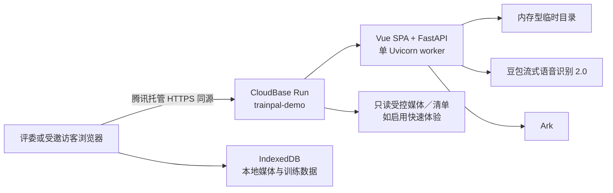

# TrainPal 竞赛版发布、验收与回滚手册

> 状态：CloudBase Run 版本 A/B、私有真实视频、公网并发 canary 与 B→A→B 回滚均已通过；GYMTI/七猫最终候选已完成本地集成，替换 `009` 前仍须通过私有门禁和候选回滚；最终素材、移动真机与录屏仍待团队验收
>
> 更新日期：2026-07-23
>
> 适用范围：独立 Web、本地视频上传、受控快速体验、真实 Provider 与腾讯云 CloudBase Run 临时竞赛入口

本手册禁止把计划值、占位项或本地通过记录表述为公网已上线事实。操作源以 [`deploy/cloudbase/foundation-plan.json`](../../deploy/cloudbase/foundation-plan.json)、[`deploy/cloudbase/README.md`](../../deploy/cloudbase/README.md) 和 [ADR-0029](../adr/0029-cloudbase-run-is-the-unfiled-competition-demo-entry.md) 为准。

## 1. 当前发布结论

截至 2026-07-23，仓库已经完成：

- CloudBase Run 非秘密基础计划、预算上限、单实例安全边界和校验脚本；
- 同源 SPA + FastAPI 镜像、健康／就绪、访问分级和测试 Provider 隔离的工程基线；
- 现有真实云内容理解 Provider 的本地受控样本 smoke 基线；
- 版本 A `trainpal-demo-007`（Build `2601400378`）的 OA 私有源码构建、签名 FFmpeg、`/health`、`/ready`、真实短视频和外部裁剪 295 秒样本；
- 版本 B `trainpal-demo-008`（Build `2601400393`）的前端合并、私有探针、真实短视频，以及 B→A→B 实际流量回滚；
- 同一版本 B 镜像的公网配置版本 `trainpal-demo-009`：SPA/history、匿名禁用真实分析、两个独立浏览器上下文、三路真实评委分析和第四路稳定 `429` 均已实测；
- 公网三条已接纳运行均收到 SSE 终态并完成，三条均诚实返回 `partial`，没有把缺口伪装成完整结果；运行结束后评委容量恢复。
- GYMTI v1、七猫资源、Dexie 单槽生命周期和无状态 API 已进入最终候选；竞赛生产默认关闭 GYMTI 模型，匿名只走本地确定性选题与模板叙事。
- 最终候选本地门禁已完成 Web 200、API 261、Playwright 20/20，以及 PowerShell／Git Bash 对同一镜像的资源、FFmpeg、生产 `/ready` 和匿名 GYMTI 零模型调用审计；CloudBase 私有候选与候选回滚仍待执行。

尚未完成或没有可审计通过记录：

- 最终答辩视频的内容选择、授权登记和人工语义标注；受控媒体入口继续明确暂缓；
- Android Chrome 与 iOS Safari 真机的选片、前后台切换、软键盘、分享和安全区验收；
- 最终五分钟讲解脚本、双份真实录屏和现场降级演练；
- 到期自动关停的执行结果；任务已安排在 2026-07-24 23:00（Asia/Shanghai）启动，硬截止为本周六 0 点。

因此当前状态是“短期公网评委入口已通过工程 canary”，不是长期生产发布，也不代表任意健身视频都能准确解析。任一安全、清理或预算门禁失败时，立即恢复公网关闭。

## 2. 发布不变量

- 当前产品是 TrainPal 独立 Web；本地视频导入是主入口，受控视频是明确标注的快速体验兜底。
- Vue SPA 与 `/api/v1/*` 从同一个容器和域名提供；浏览器不接触 Ark、ASR、对象存储写权限或服务器秘密。
- CloudBase Run 只运行一个 `trainpal-demo` 服务、一个实例上限和一个 Uvicorn worker。Analysis Run、SSE、取消句柄和容量均在单进程内存中。
- 原始上传、音频、帧、联系表、转录、提示词和模型响应只在独立临时目录或内存中存在，所有终态都清理。
- 训练档案、个性化上下文、方案、场次、记录和本地视频 Blob 留在浏览器 IndexedDB，不上传为账户数据。
- Provider-backed 分析必须使用评委体验码；`PUBLIC_ANALYSIS_CONCURRENCY=0`，匿名访客不能消耗付费分析额度。
- 测试 Provider 只允许 `APP_ENV=test`；生产环境配置测试 Provider 必须拒绝启动。
- 快速体验方案必须明确标注为示例，不能伪装成真实 AI 结果、缓存回退或用户记录。
- 当前真实 Provider 仍是已接入的 Ark + 豆包流式语音识别 2.0 路线；未完成新的质量选型前不得临时切换模型并宣称升级。
- 仓库名、镜像路径或兼容字段中的历史工程标识不构成产品品牌；用户界面和答辩统一使用 TrainPal。

## 3. CloudBase Run 拓扑



冻结配置：

| 项目 | 值 |
| --- | --- |
| CloudBase 环境 | 由发布人从本地受控配置传入且不得提交；地域 `ap-shanghai` |
| 服务名 | `trainpal-demo` |
| 容器端口 | `8000` |
| CPU / 内存 | 2 vCPU / 4 GiB |
| 最大实例 | 1 |
| 非评审期最小实例 | 0 |
| 预热与评审期最小实例 | 1 |
| CloudBase HTTP 请求超时 | 60 秒；上传创建请求必须在该窗口内返回 `202` |
| 应用异步运行安全超时 | 180 秒；创建后通过快照／SSE 继续观察 |
| 应用 worker | 1 |
| 日志 | 只写标准输出 |

CloudBase 本地存储是内存型且实例替换后消失。它只适合瞬时分析材料，不是媒体库或任务数据库。最大实例不能提高到 2；否则同一 `run_id` 的快照、SSE、取消和限流会分裂。

CloudBase 默认域名仅用于有限竞赛演示。首次访问可能出现腾讯云风险提示，二维码或链接旁必须写：

> 首次打开会看到腾讯云安全提示，请点击“确定访问”进入演示。

默认域名不得表述为长期生产域名。平台可能限制异常流量，因此评审前必须保留录屏和无需真实分析的快速体验路径。

## 4. 公网开关与访问分级

- 私有门禁期间关闭 CloudBase 公网开关和任何 HTTP Access 映射。
- 最小实例为 0 只控制成本，不等于关闭公网；访问控制必须依赖公网开关和映射状态。
- 私有门禁全部通过后，才能短时开启未公布的公网 canary。
- 匿名用户可以浏览产品页面和快速体验；开始真实 Provider 分析必须先取得评委访问会话。
- 体验码通过安全表单提交到 `POST /api/v1/access/session`，由服务端写入 Secure、HttpOnly、SameSite Cookie；体验码不得进入 URL、前端构建、截图、录屏或日志。
- 超过准入池立即返回 `429 + Retry-After`，不排队、不启动后台任务。
- canary 失败立即关闭公网开关与映射；把最小实例恢复为 0 只能作为后续成本动作。

## 5. 环境变量与秘密

秘密只能通过 CloudBase 加密环境变量或秘密界面写入。不得进入仓库、镜像层、命令行历史、聊天、截图或日志。

必需秘密：

- `ARK_API_KEY`
- `VOLC_ASR_API_KEY`
- `JUDGE_ACCESS_CODE`
- `ACCESS_COOKIE_SECRET`（生产新生成，不与体验码或 Provider Key 复用）

关键非秘密配置：

| 变量 | 生产要求 |
| --- | --- |
| `APP_ENV` | `production` |
| `ANALYSIS_PROVIDER` | `cloud` |
| `ARK_MODEL_ID` / `ARK_VISUAL_MODEL_ID` / `ARK_BASE_URL` | 使用候选版本实际验证值，发布记录只记模型 ID 与地址，不记 Key |
| `VOLC_ASR_RESOURCE_ID` / `VOLC_ASR_URL` | 与现有豆包流式语音识别 2.0 权益一致 |
| `LOCAL_UPLOAD_ENABLED` | `true`，但就绪和能力接口仍可失败关闭 |
| `LOCAL_ANALYSIS_MAX_SECONDS` | `300`；首次分析必须覆盖完整源文件，超过 300 秒在 Provider 调用前拒绝 |
| `LOCAL_UPLOAD_MAX_BYTES` | 后端能力合同 `268435456`（256 MiB）；CloudBase HTTP Access 请求体上限 20 MB，当前 Web 以 19,000,000 bytes 作为安全上限 |
| `GYMTI_LLM_ENABLED` | `false`；竞赛发布不启用可选模型增强 |
| `GYMTI_LLM_RETENTION_CONFIRMED` | `false`；未确认供应商留存边界不得构造模型客户端 |
| `RUN_TIMEOUT_SECONDS` | `180` |
| `RUN_TTL_SECONDS` | `600` |
| `ANALYSIS_EVIDENCE_TIMEOUT_SECONDS` | `170`，为 180 秒外层上限预留 10 秒终态与清理时间 |
| `ANALYSIS_CHUNK_TIMEOUT_SECONDS` | `20` |
| `ANALYSIS_VISUAL_CHUNK_SECONDS` / `ANALYSIS_VISUAL_OVERLAP_SECONDS` | `60` / `10`，顺序单并发 |
| `ANALYSIS_LATENCY_TARGET_MAX_SECONDS_PER_VIDEO_MINUTE` | 当前 smoke 门禁 `15`，不是公网 SLA |
| `JUDGE_ANALYSIS_CONCURRENCY` | 计划 `3`，必须通过三路真实并发后才开放 |
| `PUBLIC_ANALYSIS_CONCURRENCY` | `0` |
| `TRUSTED_PROXY_CIDRS` | 空；未验证代理网段前只使用直连对端地址 |
| `CORS_ORIGINS` | 只允许精确同源 HTTPS 域名，不允许 `*` |
| `WEB_STATIC_ROOT` | 构建后的 SPA 路径 |
| `IMAGEIO_FFMPEG_EXE` | 审计后只读挂载的 FFmpeg 路径 |
| `FFMPEG_BUILD_RECEIPT_PATH` | `/opt/trainpal/ffmpeg/receipt.json`；`/ready` 必须核对签名来源、配置和二进制哈希 |
| `SOURCE_MANIFEST_PATH` / `SOURCE_MEDIA_ROOT` | 如启用受控来源，指向只读清单与缓存 |
| `PUBLIC_MEDIA_BASE_URL` | 如启用受控来源，指向只读 HTTPS 媒体基址 |
| `SMOKE_ANNOTATIONS_PATH` | 只读人工标注清单，不含转录或响应 |

检查秘密时只验证“存在、非空、权限正确”，不能回显值。本地 `.env.local` 可作为授权转移来源，但转移过程不得打印。GitHub Actions 不注入真实云 Key；真实 smoke 只在受控发布机或 CloudBase 私有路径运行。

## 6. 媒体与 FFmpeg 门禁

本地上传媒体由用户请求临时提供，不进入镜像或受控媒体缓存。受控快速体验若启用，则最终清单只登记团队有权展示的 2–3 条视频，并包含稳定 ID、标题、相对媒体路径、时长和 SHA-256。

- 客户端只能提交本地 multipart 或清单中的 `source_id`，不能提交 URL、对象键或服务器路径。
- 对象存储／CDN 只允许受控前缀的只读 GET／HEAD 和 Range；服务器分析使用通过哈希的只读副本。
- 清单、缓存和对象三方哈希必须一致；缺失、多余、符号链接、路径越界、传输不完整或哈希不符都阻止就绪。
- 当前基础计划的 `assets_deferred_until_content_approval=true`。在素材、清单、公共基址与哈希审批前，不得把任何临时测试视频带入公网部署。

FFmpeg 不进入 Git，而是在 Docker 多阶段构建中从 FFmpeg 8.1.2 官方签名源码编译进最终镜像。构建收据记录版本、源码地址、配置哈希和二进制 SHA-256；最终文件系统只允许登记路径中的这一份 FFmpeg。配置不得包含 `--enable-gpl`、`--enable-nonfree` 或 GPL-only 依赖；`/ready` 和镜像审计均失败关闭。

## 7. 素材与权属

| 素材／依赖 | 发布要求 | 当前状态 |
| --- | --- | --- |
| 本地上传演示视频 | 团队自有或取得赛事展示授权；不进入 Git／镜像 | 授权样本已用于私有/Canary 验证；最终答辩内容仍待选定与登记 |
| 受控快速体验视频 | 同上；对象、清单和缓存哈希一致 | 已暂缓接入 |
| TrainPal 小猫教练 | 团队自制或获得明确赛事／Web 使用权；正式资产与代码 MIT 分开登记 | 形象资产制作中，不能用结构占位冒充最终资产 |
| 结果海报资源 | 自制或可再分发 | 待登记 |
| 字体 | 许可证允许 Web 使用／再分发；否则使用系统字体栈 | 系统字体优先 |
| FFmpeg | 版本、配置、二进制哈希、许可与源码位置完整 | 本地镜像与 CloudBase `/ready` 均已审计通过 |
| 项目代码 | `Hachimi Contributors` / MIT；第三方依赖另审 | 仓库既有许可 |

授权证据保存在团队受控位置，不把含个人信息的合同或聊天截图提交到 Git。未确认来源或授权范围不覆盖公开赛事展示的素材不能进入候选版本。

## 8. 构建与镜像验证

1. 在干净检出上安装锁定依赖并生成 API 类型，确认生成物无意外 diff。
2. 运行 `pnpm check`、端到端测试和 CloudBase 基础预检。
3. 构建同源多阶段镜像；运行镜像验证，确认非 root、只读运行、SPA history、API 404、健康接口和禁入文件。
4. 审计镜像最终文件系统及各层，确认没有 `.env*`、媒体、音频、帧、转录、模型响应、Trace、源映射、云 Key 或本机路径；FFmpeg 必须且只能命中收据登记的一份二进制。
5. 记录不可变完整提交 SHA、CloudBase Build ID、服务版本和脱敏配置快照；不能以未绑定源码的浮动名称作为发布或回滚依据。
6. 保留至少一个上一版不可变 CloudBase 版本及兼容的非秘密配置快照。

竞赛发布采用已验证的 CloudBase 源码包构建路线，不依赖此前失败的 GHCR 拉取路线。版本 A、B 的精确源码提交、Build ID 和服务版本均保存在脱敏回执中。

## 9. CloudBase 部署顺序

### 9.1 本地预检

```powershell
.\deploy\cloudbase\preflight.ps1
```

预检只验证计划、预算和固定 CLI 命令面，不认证、不上传代码、不创建资源。通过预检不等于部署通过。

### 9.2 私有基础版本

1. 在 CloudBase 控制台确认目标账号、环境、服务、价格和附加资源成本。
2. 使用 `release-source.ps1` 从干净且不可变的完整提交生成源码包，再通过已验证的 CloudBase CLI 3.6.4 提交 `trainpal-demo` 私有候选；保留交互式最终确认，不增加 `--force` 或猜测的 dry-run 参数。
3. 保持公网和 HTTP Access 关闭，配置非秘密值并无回显转移秘密。
4. 接入已批准的媒体／FFmpeg 合同，通过内部 `/health`、`/ready`、真实分析、SSE、清理和本地上传门禁。
5. 记录该版本的完整源码 SHA、Build ID、服务版本与兼容配置快照，作为回滚基线。

实际版本 A 为 `trainpal-demo-007`，Build ID `2601400378`，源码提交 `e5ba966451300c8027f174229e902acc0dd4ba94`。签名 `/health`、`/ready`、67.83 秒真实短样本和 295 秒外部裁剪样本均通过；两个样本都返回 `complete` 且没有覆盖缺口。原媒体、动作文本、转录和模型响应未写入回执或 Git。

### 9.3 候选版本与 canary

1. 构建不同不可变 digest 的候选版本，在公网仍关闭时部署为第二版本。
2. 通过全部私有门禁并确认上一版本可回滚。
3. 短时开启未公布公网 canary，依次验证公网健康／就绪、评委分析、第二浏览器、三路并发、超额 429、回滚、再前滚。
4. 任何失败都立即关闭公网；全部通过才公告链接并在评审前把最小实例设为 1。

实际版本 B 为 `trainpal-demo-008`，Build ID `2601400393`，源码提交 `81de88d0b7475797a51a4fdf73d334d5836dd529`。私有门禁通过后完成 `008 → 007 → 008` 实际回滚，再以前述同一 B 镜像生成公网配置版本 `trainpal-demo-009`。当前资源为 2 vCPU / 4 GiB、单 worker、最小/最大实例 `1/1`、访问类型 `OA + PUBLIC`；到期后恢复 `OA` 与最小实例 0。

CloudBase CLI 具体命令只从 [`deploy/cloudbase/README.md`](../../deploy/cloudbase/README.md) 复制，不在本手册维护第二套可能漂移的命令。

## 10. 健康、就绪与真实 Provider smoke

| 检查 | 通过条件 |
| --- | --- |
| `/api/v1/health` | 200，只证明进程存活，不调用 Provider |
| `/api/v1/ready` | 200 且 `{"status":"ready"}`；真实 Provider、秘密存在性、可信代理、SPA、临时目录、FFmpeg、媒体清单和单实例配置有效 |
| 未就绪 | 503 + 脱敏错误码，不暴露路径、地址、文件名、Key 或 Provider 正文 |
| SSE | 真实阶段与心跳即时刷出；断线后客户端可按快照恢复，不把断线当取消 |
| 显式取消 | DELETE 后不再接纳迟到结果，临时材料清理 |
| 本地上传 | 能力接口、MIME、大小、时长与服务端验证一致；原视频不在终态后遗留 |

真实 Provider smoke 必须使用团队授权视频和真实 Ark／豆包语音权益，至少覆盖：

- 有明确口播或字幕的视频；
- 静音、音乐或弱语音但具有可识别视觉动作的视频；
- 多动作或重复节奏视频；
- 应合法返回证据不足的困难视频。

每个样本记录人工认可的动作别名和期望时间交集。通过要求：语义与人工标注相符、范围相交、不产生重量、分支／警告一致、覆盖状态诚实、临时目录恢复、云端临时文件删除。成功输出只保留 PASS、来源 ID、标注序号、阶段耗时、总耗时、模型／Skill 版本和脱敏请求 ID；不保存动作原文、转录、帧、提示、响应或 Trace。

私有短样本和 295 秒样本证明当前部署能够在已授权样本上完成五分钟合同、SSE 和清理；公网三并发则证明限流与终态传播有效，但三条结果均为 `partial`。这些记录不能证明静音纯动作、任意多动作视频或生产准确率，最终素材仍需人工核对。

## 11. 容量门

### 11.1 测试 Provider 负载

在不接入公网的隔离测试环境，使用合成媒体和测试 Provider 验证静态页面、训练、限流和 50 会话。生产容器仍必须拒绝测试 Provider。记录成功率、预期 429、p50/p95、CPU、内存、网络和临时目录，不为未建立的指标编造阈值。

### 11.2 真实 Provider 并发

只有以下条件全部通过，才保留 `JUDGE_ANALYSIS_CONCURRENCY=3`：

- 三名独立评委会话同时完成真实分析；
- 三条 SSE 不串流，第四条请求得到预期 429；
- 全部临时材料清理；
- 2 vCPU / 4 GiB 实例在观测窗口内无 OOM、无重启、无持续临时目录增长。

任何一项失败都降低评委并发并重新 smoke；不能通过增加实例规避。公共并发始终为 0。

2026-07-23 的公网 canary 使用四个独立评委会话：三次创建返回 `202`，第四次返回带 `Retry-After` 的 `429`；三条 SSE 均到达终态且运行完成，随后新评委会话重新获得分析资格。覆盖状态均为 `partial`，该结果作为模型质量限制保留，不影响并发门本身通过。

## 12. 移动体验与演示验收

至少在一台 Android Chrome 和一台 iOS Safari 验证：

- 首次 CloudBase 默认域名提示和页面进入；
- 本地选片、上传、来源原始比例播放和浏览器前后台切换；
- 真实分析阶段、离页恢复、失败重试和覆盖状态；
- 方案摘要、动作 Bottom Sheet、用户字段编辑与 TrainPal 可选调整；
- 次数型、时长型、休息、准备继续、刷新恢复与提前结束；
- TrainPal 隐藏、低动效、素材失败和页面内休息召回；
- 结果、海报、Web Share 与下载兜底；
- 安全区、软键盘、固定主操作和至少 44 CSS px 触控目标。

五分钟演示建议：

| 时间 | 操作 | 讲解重点 |
| --- | --- | --- |
| 00:00–00:35 | 打开首页并选择团队授权的本地视频 | 当前真实入口是独立 Web 本地上传，“刷到就是练到”是价值主张 |
| 00:35–01:35 | 输入评委访问会话并显式开始分析 | 真实 Provider、真实阶段、离页可恢复、无运行时 Mock |
| 01:35–02:20 | 查看基础方案、处理一个待确认动作、编辑字段 | TrainPal 编译整份可执行提案，用户值高于全部规则 |
| 02:20–02:55 | 可选“让 TrainPal 调整这次训练”或展示已保存差异 | 个性化是主动、可解释、可拒绝，不阻塞基础方案 |
| 02:55–04:10 | 开始短训练，完成一组、休息并返回 | 来源片段减轻拖动，确定性引擎负责执行，TrainPal 提供要点与陪伴 |
| 04:10–05:00 | 完成训练、查看约卡路里、成长反馈与分享 | 保存实际结果，同设备可恢复，海报不泄露来源或档案 |

如果某项冻结能力尚未接入候选版本，演示脚本必须删除该步骤，而不是用静态文案冒充。

## 13. 日志、隐私与安全审计

- 用 `git ls-files` 和镜像层清单确认秘密、媒体、转录、响应和私有路径没有进入产物。
- 日志只包含白名单字段；审计脚本只输出命中数量和文件名，不能把疑似秘密内容打印到终端。
- 在成功、部分、证据不足、失败、取消和超时后检查临时目录无遗留。
- Caddy 历史备选和 CloudBase 访问日志都不能记录体验码、Cookie、请求正文或带签名媒体 URL。
- 未知来源 ID、任意 URL、非法本地来源 ID、越界区间或测试 Provider 在生产中都必须失败关闭。
- 发现秘密或原始内容泄露时立即关闭公网、轮换凭据、删除受影响产物并重新构建；只删日志不算恢复。

## 14. 录屏与现场降级

候选冻结后录制一份真实公网完整闭环，画面包含默认域名、版本短 SHA、真实阶段、方案编辑、训练恢复、结果和海报。录屏不显示体验码、Cookie、Key、本机路径、转录、模型响应或开发者工具 Trace。

MP4 保存在演示电脑和团队受控云盘各一份，记录 SHA-256 与时间，不提交 Git。现场网络或 Provider 故障时明确说明“下面播放的是该版本预先完成的真实录屏”，再播放；同时使用明确标注的快速体验方案让评委亲手体验训练闭环。

## 15. 已知限制

- 当前是独立 Web 与本地上传入口，不是平台分享直达；不得暗示已调用未开放的平台内容理解接口。
- 后端与 CloudBase 运行时已启用完整源文件最多 300 秒；7/19 分钟原片仍必须在外部裁剪到不超过 5 分钟。CloudBase HTTP Access 请求体上限为 20 MB，Web 使用 19 MB 安全上限，因此较大文件还必须在上传前压缩。
- 现有 Provider 对静音纯动作、多动作召回和可定位部分覆盖仍缺少充分生产证据；测试 Provider 通过不能替代真实验收。
- Analysis Run 留在单进程内存；实例替换会丢失进行中任务，用户只能重新发起。
- 训练和个性化数据只在当前浏览器设备保存，无账号、服务器备份或跨设备同步。
- CloudBase 默认域名可能出现访问确认、冷启动或平台流量限制；它是竞赛临时入口，不是正式生产域名。
- 卡路里是近似值，不是医疗或精确能量测量；TrainPal 不提供伤病诊断、姿态评分或自动负重处方。
- GYMTI v1 已有版本化题库、七张人格插画与七猫正式运行资源；当前限制是模型增强默认关闭、数据仅保存在当前浏览器，且不得把测评解释为健康或训练强度诊断。

## 16. 回滚与到期

### 回滚触发

出现以下任一情况立即关闭公网并回滚：`/ready` 持续失败、重复 5xx、SSE 串流／积压、训练主流程阻断、媒体哈希不符、临时文件持续增长、秘密或原始内容泄露、真实结果跨运行污染、实例因并发反复重启。

### 回滚步骤

1. 记录故障时间、当前 digest、配置修订、脱敏错误码和影响范围；不要先删除证据。
2. 关闭公网开关与映射，停止新分析。
3. 切换到上一不可变版本及其兼容非秘密配置快照。
4. 验证内部健康／就绪、一个脱敏真实 smoke、本地上传与快速体验训练。
5. 如需重新开放，重新执行完整未公布 canary；不能自动重试故障版本。

服务器回滚没有浏览器数据迁移或清库步骤。禁止删除用户浏览器数据、媒体审批材料或仍用于审计的故障版本记录。

CloudBase 总授权上限为人民币 300 元，精确窗口与估算以基础计划为准。非评审期最小实例保持 0；到确认演示结束或最大公网窗口先到者，关闭公网与映射、把最小实例恢复为 0，并复核或移除不再使用的计费资源。

已创建一次性关停任务，于 2026-07-24 23:00（Asia/Shanghai）开始执行：先唯一定位目标服务与根路由，禁用公网映射，再复用当前镜像把访问收紧为 OA、最小实例降为 0，并生成不含环境 ID、域名或秘密值的临时回执。任务失败时优先保持公网路由关闭并通知人工处理。

## 17. 发布检查单

- [x] 运行时提交 SHA、版本 A/B、Build ID、上一版本和兼容配置快照已记录。
- [x] CloudBase 基础预检、完整测试和镜像/FFmpeg 审计全绿。
- [x] 本地上传模式无需清单即可通过私有/公网 `/ready`；受控媒体入口继续关闭。
- [x] 本地上传符合五分钟、19 MB Web 安全上限和所有终态清理边界。
- [ ] 真实 Provider 样本覆盖口播、静音视觉、多动作和证据不足；输出已脱敏。
- [x] 三路评委并发与第四路 429 通过，无 SSE 串流、容量泄漏或媒体遗留。
- [ ] Android Chrome 与 iOS Safari 主路径通过。
- [x] 公网 canary、第二浏览器上下文、回滚、再前滚均有记录。
- [x] 体验码未进入 URL、构建、日志、截图或录屏。
- [ ] 五分钟脚本与双份录屏通过；未实现能力已从讲解中删除。
- [x] 公告前已设置评审期最小实例；一次性到期关停任务与硬截止已明确。

## 18. 关联决策

- [ADR-0011：单实例语义](../adr/0011-single-instance-competition-deployment.md)
- [ADR-0013：本地视频优先与可恢复分析](../adr/0013-local-video-import-and-recoverable-analysis.md)
- [ADR-0024：独立 Web 与可迁移愿景](../adr/0024-independent-web-is-current-while-platform-understanding-is-portable.md)
- [ADR-0025：覆盖状态](../adr/0025-provider-declares-complete-partial-or-insufficient-coverage.md)
- [ADR-0029：CloudBase Run 临时竞赛入口](../adr/0029-cloudbase-run-is-the-unfiled-competition-demo-entry.md)
