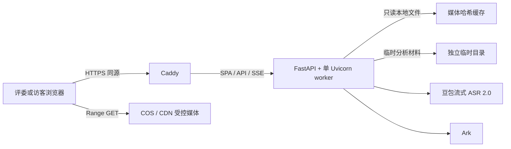

# 竞赛 Web MVP 发布、验收与回滚手册

> 状态：Issue #3 冻结的发布合同；部署实现由 Issue #8 完成
>
> 适用范围：腾讯云单机竞赛环境、2–3 个团队受控视频源、评委真实 AI 与访客快速体验
>
> 禁止将本手册中的占位项当作已验证事实。所有标记为“部署时填写”的内容必须由当班发布人现场采集。

## 1. 发布目标与不可变边界

本手册用于把哈基米练臂力动的竞赛 Web MVP 发布为一个可由评委真实操作、可回滚且不泄露媒体与密钥的 HTTPS 站点。发布成功必须同时满足：

- Web 静态资源和 FastAPI 使用同一域名；浏览器不接触 Ark、ASR、COS 写权限或服务器密钥。
- 腾讯云主机只运行一个 `app` 容器实例、一个 Uvicorn worker 和一个 `caddy` 容器，不使用多副本、持久任务队列或服务器数据库。
- Analysis Run 仍是单进程内存态；重启、SSE 断开、取消或超时都会使运行失效，迟到结果不回填。
- 公开媒体 URL 只能由 `PUBLIC_MEDIA_BASE_URL` 与版本化受控清单中的 `analysis_filename` 拼接；客户端只提交 `source_id`，不能提供 URL、对象键或本地路径。
- 评委体验码只提升真实 AI 容量优先级。访客的“快速体验方案”必须明确标注为产品示例，不得伪装成 Agent 返回或云端降级结果。
- 训练档案、草稿、方案、未完成训练和记录保留在浏览器 IndexedDB；服务器不接收或同步这些训练数据。
- 原始视频、音频、帧、转录、提示词和模型原始响应不得进入 Git、容器镜像、长期日志、CI 产物或发布录屏附件。
- 历史 GPL 项目只作行为参考，不复制其代码或组件；团队自有视频和哈肌咪素材须逐项登记权属。

`GET /api/v1/health` 只证明进程存活；`GET /api/v1/ready` 才是接入流量的门禁。现有仓库尚未包含容器、Caddy、COS 同步、访问分级和 `/ready` 实现，在 Issue #8 完成并通过本手册验收前，不得宣称生产部署已完成。

## 2. 部署事实记录

每次发布复制一份下表到发布记录中并填写。未知服务器值必须通过腾讯云控制台或只读系统命令采集，不得推测。

| 事实 | 发布记录值 |
| --- | --- |
| 发布负责人、复核人 | 部署时填写 |
| 发布开始/结束时间（Asia/Shanghai） | 部署时填写 |
| 公网域名、DNS 生效结果 | 部署时填写 |
| 腾讯云地域、实例 ID、公网 IP | 部署时填写 |
| CPU 核数、内存、可用磁盘、公网带宽 | 部署时填写 |
| 操作系统、CPU 架构 | 部署时填写 |
| Docker Engine、Compose、Caddy 版本 | 部署时填写 |
| 安全组开放端口 | 部署时填写；应只有运维 SSH、80、443 |
| 发布 Git 提交 SHA | 部署时填写，必须是完整 40 位 SHA |
| GHCR 镜像标签、不可变 digest | 部署时填写 |
| 上一个已验证 SHA 与 digest | 部署时填写 |
| COS 地域、桶、只读前缀、CDN 域名 | 部署时填写 |
| 受控媒体清单版本与 SHA-256 | 部署时填写 |
| 容器内分析临时目录 | 部署时填写 |
| Ark 模型 ID、ASR 资源 ID/权益类型 | 部署时填写，不记录密钥 |
| 实测评委/公共并发配置 | 部署时填写 |
| 50 会话与真实 AI 容量结论 | 部署时填写；附脱敏结果位置 |
| Android/iOS 真机与浏览器版本 | 部署时填写 |
| 录屏备份位置与 SHA-256 | 部署时填写，不放入 Git |

发布记录只保留状态、提交、digest、哈希、耗时、容量和脱敏错误码。不得粘贴环境文件、请求正文、完整响应或控制台密钥截图。

## 3. 生产拓扑与服务器目录



Issue #8 应版本化 `deploy/compose.yml` 与 `deploy/Caddyfile`。服务器目录固定为：

```text
/opt/hachimi/releases/<git-sha>/    # 该 SHA 对应的 Compose、Caddy 与媒体清单
/opt/hachimi/current                # 指向当前 release 的链接
/opt/hachimi/shared/.env.production # 仅 root/发布用户可读的生产环境文件
/var/lib/hachimi/media              # 只读受控媒体缓存
```

Compose 只包含：

- `app`：`ghcr.io/happyjumpup/hachimi:<git-sha>`；镜像同时包含构建后的 Vue SPA 与 FastAPI，生产命令必须显式使用 `--workers 1`，媒体缓存以只读方式挂载。
- `caddy`：固定版本镜像；只暴露 80/443，只向内部 `app` 转发。

Caddy 必须：

- 自动取得并续期 HTTPS 证书，HTTP 跳转 HTTPS。
- 对 SSE 关闭代理缓冲，使用等价于 `flush_interval -1` 的即时刷出，并将上游读取超时设为大于 180 秒。
- 不缓存 `/api/*`，保留 SSE 的 `Cache-Control: no-cache` 和 `X-Accel-Buffering: no`。
- 对 SPA 未命中路径回退 `index.html`，但不能把不存在的 `/api/*` 回退成 HTML。
- 添加合理的安全响应头；不得向外暴露内部容器地址、栈追踪或服务器路径。

服务器仅保留当前与上一个已验证 release 和镜像，赛事结束前不要清理上一个版本。媒体缓存与生产环境文件不随镜像切换而删除。

## 4. 环境变量与秘密

生产环境文件必须位于 `/opt/hachimi/shared/.env.production`，权限设为 `0600`，不复制进 release 目录、镜像、CI 日志或聊天。应用启动时必须失败关闭并校验以下内容：

| 变量 | 生产要求 |
| --- | --- |
| `APP_ENV` | 必须为 `production` |
| `ANALYSIS_PROVIDER` | 必须为 `cloud`；生产环境配置 `test` 时拒绝启动 |
| `ARK_API_KEY` | 必填秘密，只传入后端 |
| `ARK_MODEL_ID` / `ARK_BASE_URL` | 使用已验证模型与官方地址；实际值写入发布事实 |
| `VOLC_ASR_API_KEY` | 必填秘密，只传入后端 WebSocket 握手 |
| `VOLC_ASR_RESOURCE_ID` / `VOLC_ASR_URL` | 与现有流式语音识别 2.0 权益一致；不得猜测小时版或并发版 |
| `SOURCE_MANIFEST_PATH` | 指向容器内只读挂载的该 release 来源清单，例如 `/config/media-manifest.json` |
| `SOURCE_MEDIA_ROOT` | 固定为 `/var/lib/hachimi/media` |
| `PUBLIC_MEDIA_BASE_URL` | 受控 COS/CDN HTTPS 基地址；只与清单文件名拼接 |
| `JUDGE_ACCESS_CODE` | 必填高熵秘密，不进入前端构建或 URL |
| `ACCESS_COOKIE_SECRET` | 必填随机签名秘密，与体验码分离 |
| `JUDGE_ANALYSIS_CONCURRENCY` | 容量验收后填写；未通过时为 `2` |
| `PUBLIC_ANALYSIS_CONCURRENCY` | 容量验收后填写；未通过时为 `0` |
| `CORS_ORIGINS` | 仅精确生产 HTTPS 域名；同源部署不允许 `*` |
| `RUN_TIMEOUT_SECONDS` | `180` |
| `RUN_TTL_SECONDS` | `600` |

`HAKIMI_DEMO_VIDEO_PATH` 仅用于当前单视频本地开发，竞赛生产来源由清单和媒体根目录提供，生产环境不得同时依赖二者。Docker/服务器若需读取私有 GHCR，只配置最小 `read:packages` 凭据到 Docker credential store，不写进应用环境文件。

发布人检查环境文件时只检查“变量存在、权限正确、值不是空白”，不得把值输出到终端。GitHub Actions 不注入真实 Ark/ASR 密钥；真实云 smoke 只能在受控发布机或服务器执行。

## 5. COS/CDN 媒体准备与哈希门禁

### 5.1 来源清单

版本化清单只登记 2–3 个团队授权来源。每项至少包含稳定 `source_id`、标题、`analysis_filename`、SHA-256、字节数和视频时长；可附不参与下载的 `origin_url`。`analysis_filename` 必须是无目录穿越的受控相对文件名。

- 浏览器播放地址：`PUBLIC_MEDIA_BASE_URL + analysis_filename`。
- 后端分析路径：`SOURCE_MEDIA_ROOT / analysis_filename`。
- 清单不能包含任意客户端 URL、COS 写密钥、带签名临时 URL 或本机绝对路径。
- CDN/COS 仅开放清单前缀的只读 `GET`/`HEAD`，支持 Range，并返回正确的 `Content-Length`、`Content-Range` 和视频 MIME 类型。

### 5.2 同步步骤

Issue #8 必须在应用镜像中提供并由 CI 验证 `hakimi_analysis.sync_media` 命令；服务器不依赖 Node、Python 或 uv 的宿主机安装，也不得用人工拷贝替代哈希校验：

```bash
export HACHIMI_IMAGE="ghcr.io/happyjumpup/hachimi:<完整-git-sha>"
docker run --rm \
  --env-file /opt/hachimi/shared/.env.production \
  --mount type=bind,src=/opt/hachimi/current/media-manifest.json,dst=/config/media-manifest.json,readonly \
  --mount type=bind,src=/var/lib/hachimi/media,dst=/var/lib/hachimi/media \
  "$HACHIMI_IMAGE" \
  python -m hakimi_analysis.sync_media \
  --manifest /config/media-manifest.json \
  --target /var/lib/hachimi/media
```

同步器必须先下载到同目录临时文件，校验字节数和 SHA-256 后原子替换；任一缺失、多余、符号链接、路径越界或哈希不符都返回非零并阻止 `/ready`。同步完成后将缓存改为应用只读，原始视频不复制进镜像或仓库。

发布前逐项验证：

1. COS 对象哈希与清单一致。
2. 服务器缓存哈希与清单一致。
3. `/api/v1/sources` 只列清单 ID，不暴露服务器路径或对象写权限。
4. `/api/v1/sources/{id}/media` 只对已登记 ID 返回 307 到受控 CDN URL；未知 ID 返回 404。
5. 对每个 CDN 地址执行普通 GET 和 Range GET，移动端视频可拖动且演示片段能循环播放。

## 6. 发布步骤

### 6.1 发布前门禁

- Issue #4–#7 已合入候选 SHA；PR 的 CI 全绿。
- 在干净检出上运行 `pnpm install --frozen-lockfile`、`uv sync --project services/analysis-api --locked`、`pnpm api:generate`，并确认生成契约无 diff。
- `pnpm check`、`pnpm test:e2e` 通过；CI 继续只用合成媒体和测试 Provider。
- 服务器事实表已填写，DNS 指向目标主机，安全组和磁盘空间通过。
- 受控媒体、Pet、字体和第三方依赖完成权属登记。
- 当前与上一个可回滚的提交 SHA、镜像 digest 均已记录。

### 6.2 构建与发布镜像

GitHub Actions 必须从待发布提交构建多阶段镜像，并推送：

```text
ghcr.io/happyjumpup/hachimi:<完整 git-sha>
```

禁止以 `latest` 作为发布或回滚依据。工作流完成后记录仓库 SHA、镜像 digest 和 CI 链接；服务器拉取后再次核对 digest。镜像审计必须确认其中没有 `.env*`、媒体、转录、帧、测试 Trace、源映射、云密钥或本机路径。

### 6.3 部署候选 SHA

下列命令是操作顺序示例；将占位符换成事实表中的值，且不要把秘密放入命令行历史：

```bash
export HACHIMI_IMAGE="ghcr.io/happyjumpup/hachimi:<完整-git-sha>"
cd /opt/hachimi/releases/<完整-git-sha>
docker compose --env-file /opt/hachimi/shared/.env.production -f compose.yml config --quiet
docker compose --env-file /opt/hachimi/shared/.env.production -f compose.yml pull
```

1. 将该 SHA 的 `compose.yml`、`Caddyfile` 和媒体清单放入新的 release 目录并校验文件哈希。
2. 切换 `/opt/hachimi/current` 到新 release，执行媒体同步与哈希校验。
3. 运行 `docker compose up -d --remove-orphans`；不得使用 `--scale app`。
4. 查看容器健康状态和脱敏启动日志，确认应用恰好一个 worker。
5. 先从服务器本机检查 `/api/v1/health`、`/api/v1/ready`，再从公网域名检查 HTTPS。
6. 就绪、SSE、媒体 Range、真实云 smoke 和完整评委流程均通过后才打开公共入口。

### 6.4 健康与 SSE 验证

| 检查 | 通过条件 |
| --- | --- |
| `/api/v1/health` | 200，固定非敏感状态；不调用云提供方 |
| `/api/v1/ready` | 200；生产 Provider、两项 API key、来源清单、全部媒体哈希、临时目录和单实例配置均有效 |
| 未就绪 | 503 + 脱敏错误码；不得把缺密钥伪装成健康 |
| SSE | 立即收到真实阶段/心跳，代理不聚合；连接超过常规 60 秒仍持续，终态或断开时运行被清理 |
| 取消 | DELETE、切换视频或断开 SSE 后不再接纳迟到结果 |

就绪探针只验证本地配置和资源，不在每次探针请求中消耗 Ark/ASR。云端权限和真实响应由下一节 smoke 验证。

## 7. 真实云 smoke 与容量门

### 7.1 真实云 smoke

当前 `pnpm smoke:cloud` 只验证本地 `legacy-arm-workout`。Issue #8 必须扩展为按生产受控清单运行、且不输出内容的 smoke。每条演示视频至少设置一个团队人工标注触发点，并验证：

- Ark、豆包流式 ASR 2.0 和融合三个阶段都是真实成功，不使用测试 Provider、缓存候选或预置结果。
- 候选名称与人工标注语义一致，绝对片段与标注时间段相交，不产生重量。
- 结果可由用户校正并加入跨视频草稿，刷新后仍恢复。
- 本地临时目录恢复到运行前状态；Ark 临时文件删除请求成功。
- 输出只包含 `PASS/FAIL`、来源 ID、阶段耗时、总耗时、模型/Skill 版本、提供方请求 ID 和脱敏错误码；不保存转录、候选原文、帧、提示词、原始响应或 Trace。

任何一个提供方权限、权益、额度或清理校验失败都阻止发布。不得用 Mock 或快速体验方案替代真实云验收。

### 7.2 50 会话负载

使用同一候选镜像、测试 Provider 和合成媒体，在目标主机上启动只绑定 loopback 的隔离候选环境；通过 SSH 隧道从外部负载机在 30 秒内升至 50 个并发会话并保持 5 分钟，覆盖首页、来源列表、快速体验方案、训练、结果页和超额 429。隔离环境使用 `APP_ENV=test`、`ANALYSIS_PROVIDER=test`，不能接入公网 Caddy，测试后必须删除；生产容器仍必须拒绝测试 Provider。通过条件：

- 无进程崩溃、无跨会话数据污染、无意外 5xx；预期的 429 单独统计。
- 快速体验与本地训练在公共 AI 忙时仍可完成。
- 记录 HTTP 成功率、429 数、p50/p95、CPU、内存和网络，不为尚未建立的延迟基线编造阈值。
- 静态/训练流量下 CPU 峰值低于 80%，剩余内存高于 1 GB，磁盘与临时目录不持续增长。

### 7.3 三路真实 AI 容量

只有主机至少 4C/8GB，并且三名独立评委会话同时完成真实分析、三条 SSE 不串流、全部临时材料清理、CPU 峰值低于 80% 且剩余内存高于 1 GB，才可设置：

```text
JUDGE_ANALYSIS_CONCURRENCY=3
PUBLIC_ANALYSIS_CONCURRENCY=1
```

否则发布配置固定为：

```text
JUDGE_ANALYSIS_CONCURRENCY=2
PUBLIC_ANALYSIS_CONCURRENCY=0
```

超出容量立即返回用户安全的 `429` 和 `Retry-After`，不建立后台队列。公共实时 AI 关闭时，访客仍能进入明确标注的快速体验方案；评委码不得出现在网页源码、URL、截图或公共录屏中。

## 8. 安全、日志与临时材料审计

发布前后各执行一次：

- 用 `git ls-files` 和镜像文件清单确认不存在 `.env`、视频/音频、帧、转录、模型响应、Trace、源映射或私有路径。
- 检查 `/opt/hachimi/shared/.env.production` 为 `0600`，release、媒体目录和容器挂载遵循最小读写权限。
- 检查应用日志仅含允许的运行 ID、来源 ID、阶段、耗时、版本、提供方请求 ID 和脱敏错误码。
- 以只返回命中数量和文件名的审计方式检查日志；不得用会把密钥或转录值打印到终端的 `grep` 命令。
- 在成功、取消、超时、Provider 失败各运行一次后，检查事实表记录的容器临时目录无遗留运行目录。
- 确认 Caddy 访问日志不记录体验码、Cookie、请求正文或带签名媒体 URL。
- 确认生产环境配置测试 Provider 时拒绝启动，客户端提交未知 `source_id` 或任意 URL 时失败关闭。

发现密钥、体验码或原始内容进入日志/产物时，立即关闭入口、轮换对应凭据、删除受影响产物并重新构建；仅删除日志而不轮换凭据不算恢复完成。

## 9. 素材与许可登记

部署前将每一行由素材负责人和发布复核人签字。授权证据保存在团队受控位置，不把含个人信息的合同或聊天截图提交到 Git。

| 素材/依赖 | 来源与权利人 | 授权或许可证依据 | 处理与发布位置 | SHA-256 | 状态/负责人 |
| --- | --- | --- | --- | --- | --- |
| 演示视频 1 | 部署时填写 | 团队自有或明确赛事展示授权 | COS 受控前缀；服务器只读缓存 | 部署时填写 | 部署时填写 |
| 演示视频 2 | 部署时填写 | 团队自有或明确赛事展示授权 | COS 受控前缀；服务器只读缓存 | 部署时填写 | 部署时填写 |
| 演示视频 3（如使用） | 部署时填写 | 团队自有或明确赛事展示授权 | COS 受控前缀；服务器只读缓存 | 部署时填写 | 部署时填写 |
| 哈肌咪 Pet 五状态 | 团队确认拥有使用权；补记确认人和日期 | 赛事/Web 展示及优化使用确认 | 优化后透明 WebP；不从旧 GPL 代码复制组件 | 部署时填写 | 部署时填写 |
| 完成海报装饰资源 | 部署时填写 | 自制或可再分发许可 | 前端构建资源 | 部署时填写 | 部署时填写 |
| 中文字体 | 部署时填写 | 许可证允许 Web 使用/再分发；否则使用系统字体栈 | 前端或系统字体 | 部署时填写 | 部署时填写 |
| `imageio-ffmpeg` 携带的 FFmpeg | 上游发行包 | 按实际二进制构建和链接方式复核许可证 | 仅服务器运行时，不另行分发安装包 | 部署时填写 | 部署时填写 |
| 项目源代码 | Hachimi Contributors | MIT；第三方依赖许可证另审 | GHCR 镜像与 GitHub 仓库 | 发布 SHA | 部署时填写 |

任何状态未确认、来源不明或授权范围不覆盖公开赛事展示的素材都不能进入候选版本。

## 10. 五分钟评委演示脚本

演示前用无痕/干净浏览器预置的只有评委访问级别，不预置 AI 候选。全程显示真实公网域名和真实阶段，不展示密钥或体验码。

| 时间 | 操作 | 讲解重点 |
| --- | --- | --- |
| 00:00–00:25 | 打开首页并选择受控视频 | 用户寻找的是可训练动作，而不是收藏整条视频 |
| 00:25–01:35 | 跳到标注触发点，点击“添加动作” | 真实 ASR 与视觉并行；只显示真实阶段，不显示伪造百分比 |
| 01:35–02:10 | 预览、修正候选并加入草稿 | 用户最终确认；保留来源视频和演示时间段，不采信模型重量 |
| 02:10–02:40 | 调整动作参数，补一个无视频自建动作并另存为 | 多来源/无视频动作可自由编排，方案不会被 Agent 擅自决定 |
| 02:40–03:55 | 开始短训练，完成次数/时长组，经历休息并返回 | Pet 只陪伴不控制流程；休息按墙钟，动作离开页面暂停，支持隐藏 |
| 03:55–04:25 | 完成训练，进入“我的训练”查看记录 | 保存实际完成量和方案快照；同设备刷新可恢复 |
| 04:25–05:00 | 生成 1080×1920 海报并分享/下载 | 只展示方案名、时长、约卡路里、完成动作数和哈肌咪 |

现场只运行一次真实 AI，避免把大部分时间消耗在第二次云调用。若真实分析超过预期，讲解受控来源、取消语义、隐私边界和训练草稿，等待真实终态；不能切换到假候选。

## 11. 录屏备份与现场降级

在候选 SHA 冻结后录制一份真实公网完整闭环：

- 画面包含域名、版本短 SHA、真实阶段、候选校正、训练恢复、记录和海报。
- 开始前确认页面和系统通知不显示体验码、Cookie、密钥、本机路径或个人账号信息。
- 录屏只展示产品公开数据，不附转录、模型响应或开发者工具 Trace。
- 将 MP4 保存在演示电脑和团队受控云盘各一份，记录 SHA-256 与录制时间，不提交 Git。
- 现场网络或云提供方故障时，先明确说明“下面播放的是该版本预先完成的真实录屏”，再播放；不得把录屏称为现场实时结果。
- 保留无需云调用的快速体验方案作为交互备份，让评委仍能亲手完成训练、Pet、记录和海报流程。

## 12. 已知限制

对评委和团队统一披露：

- 当前是 Web-first 竞赛版，不是抖音小程序；只支持 2–3 个团队受控视频，不能上传视频或提交任意 URL。
- 动作分析依赖 Ark 与豆包流式 ASR 2.0，受网络、权益和额度影响；没有运行时 Mock 回退。
- 单实例重启或 SSE 断开会取消正在进行的分析，不恢复后台任务。
- 训练数据只在当前浏览器设备保存；无账号、跨设备同步或服务器备份。
- 评委体验码是共享的容量入口，不是用户账号；公共实时 AI 可能因容量门关闭或返回繁忙。
- 卡路里只显示单个近似值，不是医疗或精确能量测量；产品不提供伤病诊断、动作质量评分或训练处方。
- Pet 使用固定优化后的哈肌咪，可隐藏但不可更换或上传自定义形象。
- 真实样本和并发验证只覆盖本次登记素材与竞赛容量，不能外推为大规模生产可用性结论。

## 13. 上线、回滚与赛前检查单

### 13.1 打开入口前

- [ ] 事实表、素材表、当前/上一个 SHA 与 digest 填写完整。
- [ ] CI、`pnpm check`、E2E、镜像 smoke 和安全审计全绿。
- [ ] COS、服务器缓存与来源清单三方哈希一致，全部视频 Range 可播放。
- [ ] `/api/v1/health`、`/api/v1/ready`、HTTPS、SSE 超时和断开取消通过。
- [ ] 2–3 条来源真实云 smoke 通过，临时材料与 Ark 文件均清理。
- [ ] 50 会话负载与三路/降级容量门已执行，生产并发值按实测填写。
- [ ] Android Chrome 与 iOS Safari 完整流程通过。
- [ ] 评委码未出现在前端、URL、日志和录屏；访客快速体验标识清楚。
- [ ] 五分钟脚本走通，录屏双份可播放且哈希已记录。
- [ ] 发布、重启、回滚到上一 SHA、再恢复当前 SHA 的演练均通过。

### 13.2 回滚触发条件

出现以下任一情况立即停止公共实时 AI，并在无法快速恢复时回滚：`/api/v1/ready` 持续失败、重复 5xx、SSE 串流/积压、训练主流程阻断、媒体哈希不符、临时文件持续增长、密钥或原始内容泄露、真实 AI 结果跨运行污染。

### 13.3 按 SHA 回滚

1. 记录故障时间、当前 SHA/digest、脱敏错误码和影响范围；不要先删除日志或当前 release。
2. 将 `PUBLIC_ANALYSIS_CONCURRENCY=0`，阻止新的公共真实分析；评委流程若存在数据污染则同时关闭评委入口。
3. 将 `/opt/hachimi/current` 切回事实表记录的上一个已验证 release。
4. 使用上一个完整 SHA 对应的 GHCR 镜像和 Caddy/Compose/媒体清单，执行 `config --quiet`、`pull`、媒体哈希校验和 `up -d --remove-orphans`。
5. 依次验证 `/api/v1/health`、`/api/v1/ready`、来源列表、Range、SSE、一个脱敏真实云 smoke 和快速体验完整训练。
6. 回滚通过后再按容量门恢复评委/公共入口，并记录结束时间；不要自动重试部署故障版本。

浏览器训练数据位于 IndexedDB，服务器镜像回滚没有数据迁移或清库步骤。禁止为回滚删除 `/var/lib/hachimi/media`、生产环境文件或用户浏览器数据。

## 14. 关联决策

- [Web-first 与受控视频源](../adr/0007-web-first-controlled-video-sources.md)
- [显式、临时且可取消的分析管线](../adr/0008-explicit-transient-analysis-pipeline.md)
- [豆包流式语音识别模型 2.0](../adr/0009-use-streaming-input-asr-2.md)
- [Agent 不长期保存原始媒体](../adr/0006-agent-does-not-retain-raw-media.md)
- [训练场次可恢复但不在后台训练](../adr/0003-training-sessions-are-recoverable.md)
- [项目开发与验证入口](../../README.md)
