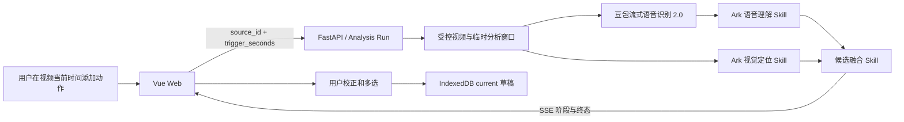

# 哈基米练臂力动：首个动作分析纵切片技术设计与开发准入说明

> 历史技术记录：产品现已更名为 TrainPal。当前产品和页面合同以 [TrainPal 竞赛 Web MVP](../specs/competition-web-mvp.md)、根目录 `CONTEXT.md` 与 ADR-0015～0028 为准；本文中的哈基米、独立候选评审和旧 Pet 计划不再指导新界面。

> 2026-07-23 更新：本文保留首个“时间点局部窗口”纵切片的历史实现记录。它曾由 [ADR-0012](../adr/0012-explicit-full-source-analysis-with-latency-budget.md) 取代为“用户显式点击后分析整段、最多 60 秒受控视频”，该 60 秒边界又已由 [ADR-0030](../adr/0030-five-minute-chunked-analysis-and-signed-ffmpeg.md) 取代为当前竞赛部署完整源文件最多 300 秒的分块路线；`trigger_seconds` 只保留兼容，不再控制首次分析范围。
>
> 既有媒体安全与分析运行边界可参考[历史本地视频规格](../specs/local-video-training-prototype.md)和 [ADR-0013](../adr/0013-local-video-import-and-recoverable-analysis.md)；下文的受控来源唯一入口、离页即取消和 60 秒产品边界均为历史实现记录。


> 状态：可进入受控的 MVP 功能开发，尚不可直接发布
>
> 基线：`8f8e177`（`foundation/initial-analysis-slice`）
>
> 更新日期：2026-07-20
>
> 主要读者：技术团队、新加入的开发者与后续编码 Agent

## 1. 结论

当前原型可以从“技术可行性验证”进入正式的 MVP 功能开发。

首个纵切片已经打通真实闭环：用户从受控视频触发分析，系统并行获取语音与视觉证据，融合为可校正的训练动作候选，再把用户确认的动作加入同设备自动保存的方案草稿。真实 Ark 与豆包流式语音识别模型 2.0 联调已经通过，取消、超时、迟到结果丢弃、临时媒体清理和前后端测试基线也已建立。

这个结论只代表“核心技术路线与工程边界足以支撑后续开发”，不代表“已经达到上线标准”。真实样本覆盖、延迟体验、抖音载体接入、生产持久化和部署合规仍需在对应阶段补齐。

## 2. 当前产品边界

### 已实现

- 从后端登记的受控视频源中选择视频；客户端不能提交任意本地路径或远程 URL。
- 在当前播放时间点击“添加动作”，默认分析前 15 秒、后 20 秒的窗口。
- 当首个窗口没有有效证据时，最多扩展一次到前 30 秒、后 40 秒。
- 语音识别与视觉理解并行，随后进行语音理解和候选融合。
- 候选支持名称和时间段校正、预览、多选，并按列表顺序加入方案草稿。
- 方案草稿支持跨视频动作、无参考视频的手工动作、参数编辑、排序、复制和删除。
- 草稿以 IndexedDB 中唯一的 `current` 记录保存，300ms 防抖自动写入，刷新后恢复。

### 后续切片

- 训练执行、组间休息和中断恢复。
- 卡路里约值。
- 哈肌咪 Pet 的训练陪伴、优化和隐藏能力。
- 方案另存为、训练记录、完成海报与分享入口。
- 抖音内置载体及其视频来源适配。

后续切片仍属于已确认的产品方向；本纵切片暂不实现它们，并不表示从产品定义中删除。

## 3. 技术架构

工程采用 pnpm workspace，不引入 Turbo 或 Nx：

- `apps/web`：Vue 3、TypeScript、Vite、Pinia、Dexie。
- `services/analysis-api`：Python 3.12、FastAPI、Pydantic、httpx、WebSocket 客户端。
- `skills`：版本化的训练语音理解、动作视觉定位、动作候选融合提示与输出契约。



媒体裁剪、音频转换、ASR、抽帧和 Schema 适配器都是确定性工具，不伪装成 Agent 或 Skill。运行时没有 Mock 回退；测试专用假适配器只能在测试环境启动。

## 4. Analysis Run 生命周期

每次分析是一个可取消、短生命周期的 `Analysis Run`：

1. 后端校验 `source_id` 和触发时间，创建内存态运行。
2. 创建运行独占的临时目录，按视频边界裁剪分析窗口并提取音频。
3. ASR 与视觉分支并行运行；ASR 结果再交给语音理解 Skill 提取动作信号。
4. 若两个正常返回的分支都没有动作证据，最多扩展一次窗口。
5. 融合语音与视觉信号，输出公开候选。
6. 通过 SSE 推送真实阶段名称和终态，不显示伪造百分比。
7. 在成功、失败、取消或超时后清理本地临时文件；Ark 临时文件在 `finally` 中删除。

运行状态为 `queued | running | completed | failed | cancelled`，阶段为：

`queued → preparing_media → analyzing_evidence → expanding_window? → fusing_candidates → terminal`

单次运行安全超时为 180 秒，终态记录仅保留运行状态、公开候选、警告、错误和 SSE 事件，不保留转录或模型原始响应。记录在进入终态 10 分钟后过期，并在下一次创建或读取运行时惰性清除；服务关闭时全部清除。

离开页面、更换视频、SSE 断开或显式取消都会取消运行。`GET` 快照用于创建后的状态读取、调试和终态查询，不承诺在 SSE 断线后恢复原运行；断线即取消是当前原型有意采用的资源边界。前端使用运行代次隔离迟到事件，已经失效的结果不能覆盖当前页面状态。

取消会撤销后端分析任务，并把取消传播给正在等待的 ASR/Ark 协程；适配器在 `finally` 中释放已取得句柄的本地或云端资源。云端提供方可能已经开始处理请求，其迟到结果不会被接纳。若上传请求在返回 Ark 文件 ID 前断开，服务端无法凭未知 ID 主动确认删除，这是进入生产前仍需解决的边界风险。

### 分支与错误语义

- 一个分支失败、另一个分支有有效证据：允许部分成功，并给出非技术化警告。
- 一个分支失败、另一个分支正常但没有证据：本次运行失败，不扩展窗口。
- 两个提供方正常返回但没有动作证据：扩展一次；仍为空则完成运行，候选为空，`empty_reason=no_evidence`。
- 系统错误导致没有证据：明确失败，不能伪装成“未识别到动作”。
- 网络错误、408、429 和 5xx：单个提供方请求最多重试两次。

当前版本的“有效证据”指至少一个通过严格 Pydantic Schema、时间顺序和分析窗口边界校验的 `SpeechSignal` 或 `VisualSegment`，不是数字置信度或事实正确性的保证。只有名称相符且时间重叠的语音、视觉证据融合后，候选才可免除 `needs_confirmation`；其余候选仍要求用户确认。

## 5. 接口契约

| 方法 | 路径 | 用途 |
| --- | --- | --- |
| `GET` | `/api/v1/sources` | 获取后端登记的受控视频源 |
| `GET` | `/api/v1/sources/{source_id}/media` | 播放受控媒体，支持 HTTP Range |
| `POST` | `/api/v1/analysis-runs` | 以 `source_id` 和 `trigger_seconds` 创建运行 |
| `GET` | `/api/v1/analysis-runs/{run_id}/events` | 通过 SSE 接收阶段和终态 |
| `GET` | `/api/v1/analysis-runs/{run_id}` | 获取运行快照 |
| `DELETE` | `/api/v1/analysis-runs/{run_id}` | 取消运行并触发清理 |

SSE 数据使用 `{sequence, type, run_id, timestamp, data}` 包络；事件类型包括运行开始/完成/失败/取消、阶段变化、分支开始/完成和心跳。当前接口版本为 `v0.1` 的项目内部契约，可支撑下一个纵切片，但尚不承诺面向第三方的长期兼容。请求/响应的精确 Schema 以版本化的 [OpenAPI 文件](../../contracts/openapi.json) 为准。

公开候选只包含：

- 动作名称和来源视频 ID。
- 绝对视频时间段。
- 次数型或时长型模式，以及组数、次数/时长、休息时间。
- 语音/视觉证据类型及其绝对时间段。
- 是否需要用户确认。

公开响应不包含数字置信度、重量、内部日志、提示词、转录全文、模型原始响应或提供方内部信息。

## 6. 草稿数据模型

草稿的核心对象是“可训练动作”，不是完整视频。每个动作都保存自己的来源和参数快照，因此同一方案可以组合多个视频，也允许手工创建没有参考视频的动作。

所有可追溯参数使用 `SourcedValue<T>`：

```ts
interface SourcedValue<T> {
  value: T | null
  source: 'video' | 'rule' | 'user' | null
}
```

取值顺序是：用户编辑覆盖现有值；未被用户编辑时优先使用视频识别值；只有视频值缺失时才补规则值。模型缺失的参数在候选阶段保持 `null`，用户加入草稿时再按模式补充规则值：

| 字段 | 默认规则 | 限制 |
| --- | --- | --- |
| 组数 | 3 组 | 可由用户修改 |
| 次数 | 次数型为 10 次 | 与时长互斥 |
| 时长 | 时长型为 30 秒 | 与次数互斥 |
| 休息 | 60 秒 | 后续训练切片可优先采用视频值 |
| 重量 | 留空 | 只允许 `user` 来源 |

动作模式未知时，必须由用户选择次数型或时长型后才能加入草稿。

## 7. 本地配置、ASR 与模型

### 本地启动

前置环境为 Node 24、pnpm 11、Python 3.12 和 uv。首次启动：

```powershell
pnpm install
uv sync --project services/analysis-api
Copy-Item .env.example .env.local
pnpm dev
```

至少在 `.env.local` 中配置：

| 变量 | 用途 |
| --- | --- |
| `ARK_API_KEY` | 视觉定位、语音理解与候选融合 |
| `VOLC_ASR_API_KEY` | 流式语音识别 2.0 |
| `HAKIMI_DEMO_VIDEO_PATH` | 后端登记的本地受控演示视频绝对路径 |

默认 Web 地址为 `http://localhost:5173`，API 地址为 `http://127.0.0.1:8000`。本地开发由 `imageio-ffmpeg` 提供 FFmpeg 可执行文件，不依赖系统 `PATH`；生产镜像从独立构建阶段只复制已删除 wheel 二进制的干净虚拟环境，并通过 `IMAGEIO_FFMPEG_EXE` 使用服务器只读挂载、由两个 SHA-256 锁定可执行文件和配置行的 FFmpeg。如果只需要运行确定性测试，不需要配置真实云密钥；完整变量清单和非敏感默认值见 [`.env.example`](../../.env.example)。

### ASR 与模型配置

当前 ASR 使用已有的豆包流式语音识别模型 2.0 权益：

- WebSocket：`wss://openspeech.bytedance.com/api/v3/sauc/bigmodel_nostream`
- 默认资源 ID：`volc.seedasr.sauc.duration`
- 并发版可替换为：`volc.seedasr.sauc.concurrent`
- 发送格式：16kHz、单声道 PCM，按 200ms 音频帧节奏发送。
- 输出适配为带词级时间戳的内部 `Transcript`；负时间戳占位 token 不进入证据。

Ark 默认模型为 `doubao-seed-2-0-lite-260215`。模型、资源 ID 和服务地址均通过环境变量替换，不写死在前端。

## 8. 安全与数据生命周期

- `ARK_API_KEY` 和 `VOLC_ASR_API_KEY` 只存在于 Git 忽略的根目录 `.env.local`，后端加载，前端构建产物不包含密钥。
- `.env.example` 可以保留非敏感默认值，但绝不包含密钥值或本机私有路径。
- 客户端只能提交后端配置的 `source_id`，不能让服务器读取任意路径或下载任意 URL。
- 原始视频不复制进仓库；音频、视频窗口和抽帧只存在于单次运行的临时目录。
- 日志只保留运行 ID、来源 ID、阶段、耗时、模型/Skill 版本、提供方请求 ID 和脱敏错误码。
- 不保存用户原始媒体、完整转录、提示词、模型原始响应或测试 Trace。

`HAKIMI_DEMO_VIDEO_PATH` 属于受信任的服务端运维配置，并会解析为绝对路径；`source_id` 白名单只能隔离客户端输入，不能替代服务端配置审计。接入真实平台来源前还需要补充文件类型、大小、访问权限和来源授权校验。

## 9. 已完成的验证

以下是基线提交 `8f8e177` 的本地验收记录，不是持续有效的线上监控结论：

- 前端 lint、TypeScript 严格类型检查、7 个单元/组件测试和生产构建。
- 后端 lint、类型检查及 34 个 API/领域/清理测试。
- 使用测试专用假适配器的 SSE 集成与确定性浏览器 E2E。
- 真实旧视频的 Ark + 流式 ASR 2.0 + 融合联调。

真实联调在约 45 秒触发，得到语义等价于“Drag Curl / 拖拽弯举”的候选；候选时间段与约 41–51 秒相交，包含语音和视觉证据，不产生重量。最近一次观测耗时为 57.79 秒，本地临时目录和 Ark 临时文件均已清理。仓库没有提交视频、帧、转录、模型原始响应或 Trace。

常用验证命令：

```powershell
pnpm check
pnpm test:e2e
pnpm smoke:cloud
```

`smoke:cloud` 需要本地受控视频和真实密钥，不能在 CI 中运行；CI 应继续使用合成媒体和测试专用适配器。

前三条命令成功时均以退出码 0 结束；云端 smoke 只输出脱敏的 PASS、阶段和耗时，不输出视频、转录或模型原始响应。测试实现位于 [`apps/web/src`](../../apps/web/src)、[`apps/web/tests`](../../apps/web/tests) 和 [`services/analysis-api/tests`](../../services/analysis-api/tests)。

## 10. 开发准入评估

| 准入项 | 状态 | 说明 |
| --- | --- | --- |
| 核心用户闭环 | 通过 | 找到视频中的动作并进入可编辑草稿 |
| 真实模型可行性 | 通过 | Ark、流式 ASR 2.0 与融合均真实成功 |
| 接口和领域边界 | 通过 | 受控来源、瞬时运行和动作/草稿 v0.1 内部契约已明确 |
| 取消、清理与密钥边界 | 通过 | 关键失败路径已有实现和测试 |
| 本地开发与回归基线 | 通过 | 一条命令覆盖前后端检查，E2E 独立运行 |
| 动作识别评测覆盖 | 待补 | 当前真实验收样本单一，不能代表复杂视频分布 |
| 交互延迟体验 | 待优化 | 57.79 秒可证明可行，但仍是明显体验风险 |
| 抖音运行环境 | 待接入 | 当前仅 Web-first 和本地受控源适配器 |
| 生产扩缩容与持久化 | 待设计 | 内存运行和单设备 IndexedDB 仅适合当前阶段 |
| 浏览器持久化健壮性 | 待设计 | 多标签页冲突、配额失败和 Schema 迁移尚无产品策略 |
| GitHub 协作流程 | 暂缓 | 标签、Issue、推送和 PR 因权限暂缓，不阻塞本地开发 |

因此，当前状态适合开始团队内的功能开发和演示迭代，不适合直接进入公开发布或大规模用户测试。

## 11. 建议的开发顺序

### P0：训练执行纵切片

优先把“草稿动作”变成“可以完成一次训练”的流程：动作播放、组/次数或计时、基于视频或规则的休息、中断恢复和完成态。它能验证用户价值是否真正从“识别动作”延伸到“完成训练”。

### P0 并行：识别评测与延迟观测

建立不提交原始媒体的本地评测清单，至少覆盖：语音主导、视觉主导、无动作、音乐噪声、多动作、视频边界和单分支失败。记录候选可用性、时间段交集、分支状态与总耗时，先形成 P50/P95 基线，再决定体验目标和优化方式。

### P1：训练体验扩展

在训练闭环上叠加卡路里约值、哈肌咪 Pet、方案另存为、完成海报与分享入口。Pet 首版沿用并优化现有哈肌咪形象，同时支持隐藏，不先引入用户自定义形象。

### P1/P2：抖音载体适配

新增抖音来源和播放适配器，但继续复用 `source_id` 受控来源契约、动作候选契约和草稿模型，避免平台能力反向污染核心领域。

## 12. 后续阶段门槛

| 阶段 | 进入条件 |
| --- | --- |
| MVP 功能开发 | 当前已满足 |
| Demo 冻结 | 训练闭环完成；多样本评测可重复；已掌握延迟分布；真实联调和清理持续通过 |
| 抖音环境联调 | 平台来源/播放适配完成；权限、网络、媒体生命周期和前后台行为验证通过 |
| 公开发布 | 部署、持久化、容量、隐私合规、监控告警和故障恢复方案完成 |

## 13. 关联文档

- [项目领域上下文](../../CONTEXT.md)
- [首个动作分析纵切片规格](../specs/initial-analysis-slice.md)
- [ADR-0007：Web-first 与受控视频源](../adr/0007-web-first-controlled-video-sources.md)
- [ADR-0008：显式瞬时分析流水线](../adr/0008-explicit-transient-analysis-pipeline.md)
- [ADR-0009：使用豆包流式语音识别模型 2.0](../adr/0009-use-streaming-input-asr-2.md)
