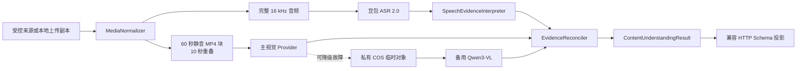

# 内容理解 Provider 生产合同

## 目标

本模块把不超过五分钟的完整健身视频转成有来源证据的动作时间线。它不生成训练处方，不读取用户档案，不拥有方案草稿，也不决定 TrainPal 的领域 Skill 编排。

## 数据流

## 时间坐标

- ASR 和语音理解使用分析范围相对时间。
- 每个视觉 Adapter 只允许返回块内 `0..chunk_duration`。
- 分块调度器添加一次块起点；`EvidenceReconciler` 添加一次来源分析范围起点。
- Run Manager 只验证绝对范围，不再添加偏移。
- 越界、未知字段、额外参数和无证据参数属于 Schema 失败，不能裁剪后继续使用。

## 结果合同

`ContentUnderstandingResult` 包含来源与分析范围、`complete | partial | insufficient`、非重叠覆盖缺口、按来源顺序排列的动作、参考片段、显式参数、字段级 evidence ID、分支状态和待确认标记。公开投影不包含模型、Provider、内部置信度、原始证据文本或重量字段。

训练参数必须引用带时间的语音证据；没有证据时保持 `null`。视觉可以支持动作名称与片段，但不能单独补出组数、次数、时长或休息。

## 预算与降级

版本化 Profile：300 秒／256 MiB；60／10 秒、最多 6 块；语音 45 秒；视觉单次尝试 20 秒；证据截止 170 秒；运行 180 秒；清理预留 10 秒；每 Provider 每块最多 2 次；总视觉调用 12 次。

降级状态属于单次运行，熔断器属于进程。主路线最终失败后，当前与剩余块直接走备用；成功块不重跑。有效空结果表示 Provider 正常检查但没有证据，不触发备用。

## Prompt Contract 与领域 Skill

`services/analysis-api/provider-contracts/` 只定义媒体到结构化证据的内部合同，并在启动与 `/ready` 校验语义和哈希。`skills/` 下的训练编译、个性化调整和动作要点补充是 TrainPal 可编排的领域能力。两者不可互换，也不能把 Provider 重试包装成 Agent 工具循环。

## 能力状态

| 层级 | 当前合同 |
| --- | --- |
| 代码能力 | 最多 300 秒，完整分块和覆盖缺口 |
| 部署 Profile | 单实例、内存运行、主路线必需；备用路线默认关闭 |
| 对外能力 | 默认 60 秒；五分钟 Canary 收据与当前 commit 匹配后才可发布 300 秒 |
| 尚未交付 | 真实 A/B/C 冠军、真实跨厂商备用、CloudBase 三并发与回滚收据、10–30 分钟异步任务 |

## 安全日志

只允许 Provider 名称、Adapter 版本、块序号、尝试次数、输入字节、排队／媒体／推理／整理／清理耗时、降级原因、脱敏请求 ID 和错误码。禁止文件名、对象 key、签名 URL、转录、Prompt、模型原文和媒体内容。

