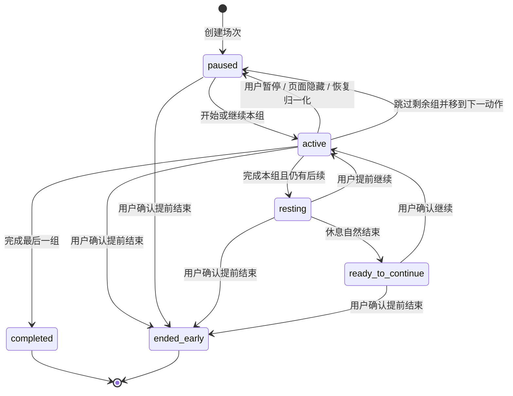

# TrainPal 方案、训练场次与本地数据合同

> 状态：训练状态机基线已接受；TrainPal 个性化与 Skill 持久化为冻结后的接入合同
>
> 更新日期：2026-07-23

## 1. 边界与原则

确定性训练引擎只消费用户已经确认的当前方案，不调用内容理解 Provider 或 LLM，也不评价动作顺序、训练量、伤病风险或训练效果。

- 当前设备同时最多存在一个未完成训练，固定存为 `sessions/current`。
- 用户导入的来源视频以 Blob 保存在同一浏览器数据库，可以被方案、场次和记录引用，但不是训练记录本身，也不成为服务端长期资产。
- 开始训练会深拷贝方案快照；之后编辑草稿、方案库或个性化上下文不能改变正在训练或已经完成的记录。
- 活动训练只累计前台实际执行时间；组间休息按墙钟流逝，但计入训练时长最多不超过计划休息时间。
- 未完成训练可恢复，但不进入训练记录，也不产生最终卡路里或海报。
- 自建动作没有来源视频和参考片段，训练页显示无视频状态，不自动匹配替代视频。
- 本地来源媒体丢失时保留动作、参数和训练控制，并要求用户重新选择原视频；不得静默换片或阻止完成训练。
- TrainPal 呈现、动作要点、卡路里、训练记录、成长和海报都是状态或终态记录的消费者，不能反向控制状态机。
- 用户对方案字段的修改高于视频值、规则值和 TrainPal 建议；只要仍满足可执行结构，系统不能用推荐范围阻止用户保存或训练。

## 2. 本地数据版本与迁移

当前工程基线使用 Dexie v4，内部数据库名称为既有兼容标识。v4 保持 v3 表结构，并只增加数据迁移：

```ts
db.version(4).stores({
  drafts: '&id, updatedAt, linkedPlanId',
  plans: '&id, updatedAt, createdAt, name',
  sessions: '&id, sessionId, status, updatedAt',
  records: '&id, endedAt, outcome',
  profiles: '&id, updatedAt',
  preferences: '&id, updatedAt',
  localMedia: '&sourceId, importedAt, updatedAt',
})
```

三个 Skill 的成功结果、任务幂等信息和个性化上下文需要同设备持久化。接入切片可以在上述记录中嵌入版本化子对象，或通过一次新的 Dexie 版本增加专用表；物理方案必须在实现前锁定并用迁移测试证明，不得修改 v3 迁移函数、重建数据库或用清库恢复异常。

迁移要求：

- 旧记录缺少来源种类时按 `controlled` 读取，不批量重写动作 ID。
- 旧三态来源记录保持原语义；只有用户确认的新个性化差异才写入 `personalized`。
- 旧教练可见性字段映射到新的 TrainPal 可见性偏好；兼容键不是用户界面命名。
- v3 偏好、场次和记录缺少教练风格时补 `coachStyleId: null`；保留旧 `petId: 'hachimi'` 只作兼容，不把它展示或推断成任何正式小猫风格。
- 任一迁移异常整体回滚并提示“本机训练数据暂时无法读取”，不得自动清空。

## 3. 方案与字段来源

### 3.1 通用类型

```ts
type FieldSource = 'video' | 'rule' | 'personalized' | 'user'

interface SourcedValue<T> {
  value: T
  source: FieldSource
}

interface SourceRange {
  startSeconds: number
  endSeconds: number
}

interface SourceEvidenceSnapshot {
  originalName: string | null
  ranges: SourceRange[]
  explicitParameters: Record<string, unknown>
  evidenceKinds: Array<'speech' | 'visual' | 'text'>
}

interface DraftSourceRef {
  sourceId: string
  title?: string
  originUrl?: string
  kind?: 'controlled' | 'local'
  referenceRange?: SourceRange
  localMedia?: LocalMediaFingerprint
  evidenceSnapshot?: SourceEvidenceSnapshot
}
```

公开方案不保存片段用途分类。来源片段默认只是参考；可靠来源节奏使用独立的时间线级输入，在训练编译阶段展开为扁平动作安排。

### 3.2 来源优先级

- `video`：视频明确表达的组数、次数、时长或休息，以及可靠来源节奏提供的执行默认值。
- `rule`：视频缺失参数时，由版本化确定性规则补充的可修改值。
- `personalized`：用户主动运行个性化调整并整体确认后写入的差异值。
- `user`：用户输入或手动修改，优先于全部其他来源。

重量只允许 `user` 来源。创作者使用的重量、规则值或 TrainPal 建议都不能直接进入用户负重字段。

接受个性化提案只更新提案中已经展示、仍未被用户修改的字段；用户随后编辑时，该字段立即改为 `user`。恢复基础方案只撤销当前方案中的 `personalized` 差异，不撤销用户值，也不删除个性化上下文。

### 3.3 草稿与方案

```ts
interface DraftPlan {
  id: 'current'
  name: string
  linkedPlanId: string | null
  revision: number
  items: DraftItem[]
  updatedAt: string
}

interface SavedPlan {
  id: string
  name: string
  revision: number
  items: DraftItem[]
  createdAt: string
  updatedAt: string
}
```

- 当前设备只有一个未命名草稿，300ms 防抖自动保存。
- 基础方案提案在用户确认前不能写入草稿。草稿为空时可确认写入；草稿非空时必须让用户明确追加或替换。
- 打开已保存方案后直接编辑原方案；“另存为”创建副本并把草稿链接到新方案。开始训练不会自动保存方案。
- 快速体验方案是显式标注的版本化 Fixture，选择后只复制到草稿，不得伪装成 AI 结果。
- 删除方案不删除由它产生的场次或记录；若草稿链接该方案，删除事务只解除链接并保留内容。

### 3.4 展开式执行时间线

- 可靠来源节奏中的动作、休息和切换按绝对时间展开；循环内容形成 `A1 → B1 → A2 → B2` 这类扁平顺序。
- 每次出现拥有不同动作安排 ID。轮次只作展示标签，不进入状态机；组数只表示同一次动作安排中的连续组数。
- 没有可靠来源节奏时，标准动作、器械和变式相同的重复演示合并为一个方案动作，证据最完整的连续范围成为参考片段，其余范围留在只读证据快照中。
- 器械、变式或视频明确参数不同的同名动作保持分开；时间重叠且名称冲突时形成一个待确认动作。
- 待确认动作原位保留但默认排除。用户确认、修改或删除后才成为可执行动作；不发起多轮问答。

## 4. TrainPal Skill 任务与个性化

### 4.1 任务信封

```ts
interface SkillTaskEnvelope {
  task_id: string
  task_type: 'training_compilation' | 'personalization' | 'action_tips'
  contract_version: string
  skill_version: string
  input_version: number
  input_fingerprint: string
}

interface SkillTaskResult<T> {
  envelope: SkillTaskEnvelope
  status: 'running' | 'succeeded' | 'failed_retryable' | 'failed_terminal'
  value: T | null
  createdAt: string
  completedAt: string | null
}
```

相同 `task_id + input_fingerprint + contract_version + skill_version` 的重复请求复用同一次运行或成功结果。刷新或返回页面不重新调用模型；只有用户明确重试或重新生成才创建新任务。输入变化、任务被替换或页面已经接受更新版本时，迟到结果必须丢弃。

三个 Skill 各用独立小载荷，不接收原始媒体、不写草稿、不读取训练场次，也不互相调用：

1. 训练编译 Skill 消费完整内容理解结果并输出基础方案提案；缺失参数由确定性规则补齐。
2. 动作要点补充 Skill 按已确认动作非阻塞运行；待确认动作确认后只触发该动作。
3. 个性化调整 Skill 只在用户主动选择“让 TrainPal 调整这次训练”时运行。

### 4.2 个性化上下文

```ts
interface PersonalizationContext {
  gymti: { version: string; resultId: string } | null
  trainingExperience: string | null
  coachStyleId: string | null
  profile: TrainingProfile | null
  signals: TrainingSignal[]
  revision: number
  updatedAt: string
}
```

稳定个性信息只能由用户明确设置或修改。年龄、性别、身高、体重均可不填，主要用于卡路里约值，只能在视频证据和规则候选范围已经形成后作为个性策略的弱参考；不得据此推断 GYMTI、训练经验、健康状态或直接决定训练强度。

训练信号必须关联具体动作、方案或场次，例如结构化轻反馈、实际完成、场次调整接受／拒绝和参数再次修改。单条信号不是跨视频默认值，也不能被 LLM 扩写为自由用户画像。

### 4.3 个性化提案时效

```ts
interface PersonalizationProposal {
  task: SkillTaskEnvelope
  basePlanRevision: number
  contextRevision: number
  changes: PersonalizationChange[]
  generatedAt: string
}
```

- 基础方案变化后，旧提案不可应用。
- 用户重测 GYMTI、切换教练风格或修改个人信息后，旧提案仍可应用，但界面提示“TrainPal 对你的了解已经更新，建议重新调整”。
- 成功提案在返回页面或刷新后保持不变；只有用户明确点击“重新调整”才生成新提案。
- 没有差异是合法成功结果。失败时基础方案继续可用，不展示部分差异，也不把规则值伪装成个性化结果。
- 个性化不能替换、增加、删除或重排动作，不能增加重量，也不能覆盖 `user` 值。修改视频明确值必须突出理由并由用户确认。

## 5. 动作要点

```ts
type TipBasis = 'video' | 'web' | 'model'
type TipStatus = 'ready' | 'no_reliable_tip' | 'failed_retryable'

interface ActionTip {
  text: string
  basis: TipBasis
  videoRange?: SourceRange
  citation?: { title: string; url: string }
}

interface ActionTipResult {
  itemId: string
  status: TipStatus
  tips: ActionTip[]
}
```

- 每个已确认动作最多三条要点，只涉及准备姿势、动作路径、呼吸、节奏和常见代偿。
- `web` 必须保留可点击引用；`model` 明确显示为“TrainPal 通用建议”。视频、网页和模型冲突时按 `video > web > model` 选择。
- 要点失败不阻塞方案、编辑或训练。成功动作保持稳定，重试只处理失败或无可靠要点的动作。
- 训练中只读取已保存要点，不联网、不调用模型、不判断实时姿态。
- 用户反馈疼痛或眩晕时不再生成训练调整，只提示停止训练并寻求专业帮助。

## 6. 本地媒体

```ts
interface LocalMediaFingerprint {
  fileName: string
  mimeType: string
  sizeBytes: number
  lastModified: number
  durationSeconds: number
}

interface LocalSourceMedia extends LocalMediaFingerprint {
  sourceId: `local:${string}`
  blob: Blob
  importedAt: string
  updatedAt: string
}
```

- 本地导入先完成能力、类型、大小和时长检查，再把 Blob 与指纹写入 `localMedia`。
- 保存失败可保留当前标签页内存 Blob，但不能显示“已保存到本机”。
- 重新选择媒体时必须通过基础指纹和时长校验，才能替换同一个 `sourceId` 的 Blob；替换不改写方案、场次或记录快照。
- 结构校验不要求 Blob 此刻可读；Blob 缺失只影响参考播放，不能把视频动作改成自建动作。
- 新候选加入草稿前必须处理 `needs_confirmation`；公开候选和 `DraftItem` 都不保存 `segment_role`。旧草稿中的历史 `segmentRole` 只兼容读取，并在下一次规范化写入时删除。

## 7. 方案快照、场次与记录

```ts
interface PlanSnapshot {
  name: string
  source: 'draft' | 'saved' | 'sample'
  sourcePlanId: string | null
  items: DraftItem[]
  tipSnapshotVersion: string | null
}

type SessionStatus = 'active' | 'resting' | 'ready_to_continue' | 'paused'
type PauseReason = 'before_start' | 'user' | 'page_hidden' | 'recovered' | 'between_actions'

interface ActionProgress {
  itemId: string
  completedSets: number
  activeMilliseconds: number
  skipped: boolean
  feedbackAsked: boolean
}

interface TrainingSession {
  id: 'current'
  sessionId: string
  revision: number
  status: SessionStatus
  pauseReason: PauseReason | null
  plan: PlanSnapshot
  coachStyleId: string | null
  currentItemIndex: number
  currentSetIndex: number
  currentSetActiveMilliseconds: number
  activeStartedAt: string | null
  restStartedAt: string | null
  restEndsAt: string | null
  scheduledRestSeconds: number | null
  creditedRestMilliseconds: number
  progress: ActionProgress[]
  startedAt: string
  updatedAt: string
}
```

`currentItemIndex`、`currentSetIndex` 从 0 开始，指向下一组要执行的动作和组。`progress` 与方案动作一一对应。完成本组后先累积实际完成量并推进索引，再进入休息；因此休息与准备继续期间，索引始终指向下一步。

记录保存不可变方案快照、实际完成量、教练风格快照、卡路里值和计算方法，不保存可变档案原值。训练总时长固定为 `activeSeconds + creditedRestSeconds`，不使用开始至结束的墙钟差。

动作结果由实际量派生：完成全部目标组为 `completed`；完成至少一组但未完成全部为 `partial`；一组都未完成为 `skipped`。未完成一整组的活动时间仍计入活动时间和卡路里，但不伪装成已完成次数或时长。

## 8. 开始训练与结构校验

“开始训练”只验证可执行结构：

- 至少一个动作；动作 ID 唯一且名称非空。
- 组数为正整数；次数型必须有正整数次数且时长为空，时长型反之。
- 休息秒数为非负整数；重量为空或正数，且非空重量来源必须为 `user`。
- 视频动作的来源引用与有效参考范围同时存在；自建动作二者同时为空。
- 参考范围位于已知视频边界内。

结构校验不评价科学性或健康风险。非阻塞安全提示与结果同时显示；用户值超出 TrainPal 建议范围但仍可执行时最多提示，不阻止开始。

校验通过后，在一个 Dexie 写事务中以固定主键 `current` 执行原子新增。已有场次时返回 `active_session_exists`，界面只提供继续或明确结束，不能覆盖。新场次初始为 `paused/before_start`；用户再次点击“开始本组”后才进入 `active`。

## 9. 状态机



`completed` 与 `ended_early` 是终态事件，不留在 `sessions` 表。同一事务写入 `records/{sessionId}` 后删除 `sessions/current`。

### 9.1 次数型与时长型

- 次数型不自动计数。用户点击“完成本组”时，把目标次数记为该组完成量。
- 时长型只按前台活动时间倒计时，达到目标后自动完成；暂停、隐藏或刷新不补算后台时间。
- 活动计时在内存使用单调时钟，每秒提交增量，并在命令、页面隐藏和卸载前立即提交。
- 完成本组后把本组活动时间移入动作进度并清零。仍有后续时按当前安排进入休息；休息为 0 时直接进入准备继续。

### 9.2 休息、离开与恢复

- 进入休息时一次写入 `restStartedAt`、`restEndsAt` 和计划休息秒数；界面从墙钟推导剩余时间。
- 用户提前继续时，计入实际休息并进入活动状态；自然结束时按计划上限计入并进入准备继续，绝不自动开始。
- 离开训练路由后休息继续；所有非训练页使用同一个轻量恢复入口。
- 活动状态下页面隐藏或离开训练路由时，先结算前台增量，再转为 `paused/page_hidden`。
- 刷新读取到活动状态时不补算墙钟，直接归一化为 `paused/recovered`；读取到过期休息时按计划上限归一化为准备继续。
- 只有用户主动选择“休息结束提醒我”时才请求设备通知；拒绝或不支持时只保留页面内召回。点击提醒仍进入准备继续。

### 9.3 跳过、提前结束与反馈

- 跳过剩余组先结算当前活动时间，保留已完成组和全部活动时间；存在下一动作时移动到下一动作并暂停，用户明确开始后才继续。
- 提前结束在任何非终态都要求确认，只保存实际完成量，不生成完整完成海报。
- 每个动作至多在首个正式组后询问一次“太累 / 刚好 / 太轻”。反馈不是姿态、伤病或人格判断。
- “太累”或“太轻”可由确定性规则提出仅影响本场当前动作剩余组的休息、次数、时长或组数调整，必须由用户确认；不调用 LLM、不增加重量、不改其他动作或已保存方案。

## 10. 一致性与幂等

- 所有场次命令携带调用方读到的 `revision`。事务只在 revision 匹配时更新并递增；冲突时重新加载最新场次并暂停当前视图。
- 完成本组、自动完成、跳过、暂停和有界调整都通过同一训练 Repository 调用状态机，视图不能直接写表。
- 终态事务先按 `sessionId` 查记录；已存在则返回原记录，否则新增后删除当前场次。重复完成、返回键重放或刷新不生成第二条记录。
- 清除本机训练数据必须显式确认，并在一个事务中清空媒体和训练数据、停止待写任务、释放对象 URL。它不删除正在服务端运行的分析；界面应要求用户先明确取消该运行。

## 11. 领域事件与 TrainPal 呈现

```ts
type TrainingEvent =
  | { type: 'session.started'; sessionId: string }
  | { type: 'set.started'; itemId: string; setIndex: number }
  | { type: 'set.completed'; itemId: string; setIndex: number }
  | { type: 'session.paused'; reason: PauseReason }
  | { type: 'rest.started'; endsAt: string }
  | { type: 'rest.finished' }
  | { type: 'feedback.recorded'; itemId: string; value: 'too_hard' | 'just_right' | 'too_easy' }
  | { type: 'adjustment.decided'; itemId: string; accepted: boolean }
  | { type: 'action.skipped'; itemId: string }
  | { type: 'session.completed'; recordId: string }
  | { type: 'session.ended_early'; recordId: string }
```

TrainPal 使用待机、训练、休息、暂停、完成五种呈现状态。角色加载失败、被隐藏或启用低动效都不改变状态机；隐藏时必须保留等价文字、要点、安全信息和控制。训练阶段最多显示一条当前要点，点击后才展开；休息阶段可把 TrainPal 与倒计时作为视觉中心。

陪伴成长只按有效训练日累积：同一本地自然日只要产生至少一条包含实际完成动作的记录就计一次，停练不倒退。成长只解锁表达、纪念卡与共同训练回顾，不改变训练参数、Agent 权限或安全边界。

## 12. 卡路里、记录与海报

档案四项完整时使用当前 Mifflin–St Jeor 基线：

```text
RMR = 10 × weightKg + 6.25 × heightCm - 5 × age + sexOffset
sexOffset = 5 (male) 或 -161 (female)

kcal = round(
  RMR / 1440 × (3.5 × activeMinutes + 1.0 × creditedRestMinutes)
)
```

年龄、性别、身高或体重缺失任一项时使用通用约值：

```text
kcal = round(4 × activeMinutes + 1 × creditedRestMinutes)
```

结果不得小于 0，只显示“约 N 千卡”。暂停、准备继续、后台停留和完成后的时间不计入。训练记录保存值与方法，之后修改档案不重算历史。

完整结束和提前结束都生成记录，但只有完整结束可以生成 1080×1920 PNG 海报。海报只读取方案名称、训练时长、约卡路里、完成动作数和 TrainPal；不得包含动作／组数明细、训练档案、来源视频、AI 原始结论或置信度。优先使用 Web Share API，失败时提供下载。

## 13. 验收场景

- 旧数据库无损迁移，既有方案、场次、记录和来源值保持可读。
- 四态字段来源可追溯；用户值不会被规则、视频或个性化覆盖，重量只接受用户来源。
- 可靠来源节奏展开为扁平顺序；无可靠节奏的重复演示正确合并且不把片段时长当训练时长。
- 三个 Skill 的重复提交、刷新复用、显式重试、输入变化和迟到结果均遵守任务时效。
- 基础方案变化使个性化提案不可应用；上下文变化只提示，成功提案不静默漂移。
- 动作要点失败不阻塞训练；网页引用、模型回退和冲突优先级可验证，训练中无网络调用。
- 次数型、时长型、休息自然结束、提前继续、页面隐藏、刷新恢复均产生正确实际时间。
- 连续双击、两标签页冲突和终态重试只推进一次并产生一条记录。
- 结构化反馈只触发需确认的本场有界调整；疼痛／眩晕进入停止与专业帮助提示。
- 完整结束、提前结束、媒体丢失、TrainPal 隐藏、素材失败、通知拒绝和分享不支持均有可用路径。

## 14. 当前实现差距

截至 2026-07-22，Dexie v4、可空教练风格快照、单一活动场次、训练状态机、记录、卡路里和七猫五态播放器已有工程基线。以下是冻结合同而非已完成声明：

- 四态来源中的 `personalized` 全链路与旧数据迁移；
- 三个领域 Skill 的持久化任务、幂等键和成功结果复用；
- 基础方案提案取代独立候选收件箱；
- 来源节奏结构与公开旧分类字段移除；
- GYMTI／训练经验、风格推荐与确认写入、个性化上下文与提案时效；
- 带依据动作要点、结构化轻反馈、有界场次调整、成长和设备休息提醒。

相关切片在持久化或公开接口落地前必须补充迁移、Repository、状态机与端到端测试，不能只改界面文案。

## 15. 关联决策

- [ADR-0010：本地训练数据与单一活动场次](../adr/0010-local-training-data-and-single-active-session.md)
- [ADR-0016：个性化上下文](../adr/0016-personalization-context-uses-explicit-facts-and-contextual-signals.md)
- [ADR-0017：来源片段与可靠来源节奏](../adr/0017-source-clips-are-reference-unless-reliable-rhythm-exists.md)
- [ADR-0018：三个领域 Skill](../adr/0018-trainpal-orchestrates-base-compilation-and-optional-personalization.md)
- [ADR-0019：个性化提案时效](../adr/0019-plan-changes-invalidate-personalization-proposals.md)
- [ADR-0020：动作要点联网与模型回退](../adr/0020-web-search-enriches-tips-with-labeled-model-fallback.md)
- [ADR-0021：独立 Web 休息召回](../adr/0021-independent-web-rest-recall-is-in-app-first.md)
- [ADR-0022：陪伴成长](../adr/0022-companion-growth-rewards-training-days-not-intensity.md)
- [ADR-0023：Skill 任务幂等](../adr/0023-skill-tasks-are-idempotent-and-version-bound.md)
