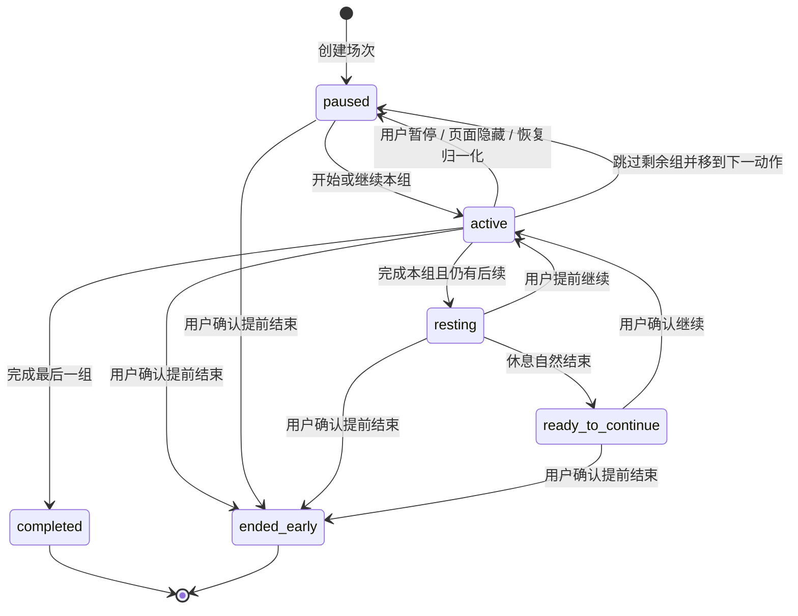

# TrainPal 方案、训练场次与本地数据合同

> 状态：训练状态机与 GYMTI v1 本地生命周期已实现；TrainPal 个性化与其余 Skill 持久化仍为冻结后的接入合同
>
> 更新日期：2026-07-23

## 1. 边界与原则

确定性训练引擎只消费用户已经确认的当前方案，不调用内容理解 Provider 或 LLM，也不评价动作顺序、训练量、伤病风险或训练效果。

- 当前设备同时最多存在一个未完成训练，固定存为 `sessions/current`。
- 用户导入的来源视频以 Blob 保存在同一浏览器数据库，可以被方案、场次和记录引用，但不是训练记录本身，也不成为服务端长期资产。
- 开始训练会深拷贝方案快照；之后编辑草稿、方案库或个性化上下文不能改变正在训练或已经完成的记录。
- 活动训练只累计前台实际执行时间；组间休息按墙钟流逝，但计入训练时长最多不超过计划休息时间。
- 未完成训练可恢复，但不进入训练记录，也不产生最终卡路里或海报。
- 自建动作没有来源视频和参考片段，训练页显示无视频状态，不自动匹配替代视频。
- 本地来源媒体丢失时保留动作、参数和训练控制，并要求用户重新选择原视频；不得静默换片或阻止完成训练。
- TrainPal 呈现、动作要点、卡路里、训练记录、成长和海报都是状态或终态记录的消费者，不能反向控制状态机。
- 用户对方案字段的修改高于视频值、规则值和 TrainPal 建议；只要仍满足可执行结构，系统不能用推荐范围阻止用户保存或训练。

## 2. 本地数据版本与迁移

当前工程基线使用 Dexie v5，内部数据库名称为既有兼容标识。v5 在 v4 训练数据表之外增加三个 GYMTI 单槽表：

```ts
db.version(5).stores({
  drafts: '&id, updatedAt, linkedPlanId',
  plans: '&id, updatedAt, createdAt, name',
  sessions: '&id, sessionId, status, updatedAt',
  records: '&id, endedAt, outcome',
  profiles: '&id, updatedAt',
  preferences: '&id, updatedAt',
  localMedia: '&sourceId, importedAt, updatedAt',
  gymtiAttempts: '&id, attemptId, updatedAt',
  gymtiPendingResults: '&id, resultId, updatedAt',
  gymtiResults: '&id, resultId, updatedAt',
})
```

三个 Skill 的成功结果、任务幂等信息和个性化上下文需要同设备持久化。接入切片可以在上述记录中嵌入版本化子对象，或通过一次新的 Dexie 版本增加专用表；物理方案必须在实现前锁定并用迁移测试证明，不得修改 v3 迁移函数、重建数据库或用清库恢复异常。

迁移要求：

- 旧记录缺少来源种类时按 `controlled` 读取，不批量重写动作 ID。
- 旧三态来源记录保持原语义；只有用户确认的新个性化差异才写入 `personalized`。
- 旧教练可见性字段映射到新的 TrainPal 可见性偏好；兼容键不是用户界面命名。
- v3 偏好、场次和记录缺少教练风格时补 `coachStyleId: null`；保留旧 `petId: 'hachimi'` 只作兼容，不把它展示或推断成任何正式小猫风格。
- 任一迁移异常整体回滚并提示“本机训练数据暂时无法读取”，不得自动清空。

## 3. 方案与字段来源

### 3.1 通用类型

```ts
type FieldSource = 'video' | 'rule' | 'personalized' | 'user'

interface SourcedValue<T> {
  value: T
  source: FieldSource
}

interface SourceRange {
  startSeconds: number
  endSeconds: number
}

interface SourceEvidenceSnapshot {
  originalName: string | null
  ranges: SourceRange[]
  explicitParameters: Record<string, unknown>
  evidenceKinds: Array<'speech' | 'visual' | 'text'>
}

interface DraftSourceRef {
  sourceId: string
  title?: string
  originUrl?: string
  kind?: 'controlled' | 'local'
  referenceRange?: SourceRange
  localMedia?: LocalMediaFingerprint
  evidenceSnapshot?: SourceEvidenceSnapshot
}
```

公开方案不保存片段用途分类。来源片段默认只是参考；可靠来源节奏使用独立的时间线级输入，在训练编译阶段展开为扁平动作安排。

### 3.2 来源优先级

- `video`：视频明确表达的组数、次数、时长或休息，以及可靠来源节奏提供的执行默认值。
- `rule`：视频缺失参数时，由版本化确定性规则补充的可修改值。
- `personalized`：用户主动运行个性化调整并整体确认后写入的差异值。
- `user`：用户输入或手动修改，优先于全部其他来源。

重量只允许 `user` 来源。创作者使用的重量、规则值或 TrainPal 建议都不能直接进入用户负重字段。

接受个性化提案只更新提案中已经展示、仍未被用户修改的字段；用户随后编辑时，该字段立即改为 `user`。恢复基础方案只撤销当前方案中的 `personalized` 差异，不撤销用户值，也不删除个性化上下文。

### 3.3 草稿与方案

```ts
interface DraftPlan {
  id: 'current'
  name: string
  linkedPlanId: string | null
  revision: number
  items: DraftItem[]
  updatedAt: string
}

interface SavedPlan {
  id: string
  name: string
  revision: number
  items: DraftItem[]
  createdAt: string
  updatedAt: string
}
```

- 当前设备只有一个未命名草稿，300ms 防抖自动保存。
- 基础方案提案在用户确认前不能写入草稿。草稿为空时可确认写入；草稿非空时必须让用户明确追加或替换。
- 打开已保存方案后直接编辑原方案；“另存为”创建副本并把草稿链接到新方案。开始训练不会自动保存方案。
- 快速体验方案是显式标注的版本化 Fixture，选择后只复制到草稿，不得伪装成 AI 结果。
- 删除方案不删除由它产生的场次或记录；若草稿链接该方案，删除事务只解除链接并保留内容。

### 3.4 展开式执行时间线

- 可靠来源节奏中的动作、休息和切换按绝对时间展开；循环内容形成 `A1 → B1 → A2 → B2` 这类扁平顺序。
- 每次出现拥有不同动作安排 ID。轮次只作展示标签，不进入状态机；组数只表示同一次动作安排中的连续组数。
- 没有可靠来源节奏时，标准动作、器械和变式相同的重复演示合并为一个方案动作，证据最完整的连续范围成为参考片段，其余范围留在只读证据快照中。
- 器械、变式或视频明确参数不同的同名动作保持分开；时间重叠且名称冲突时形成一个待确认动作。
- 待确认动作原位保留但默认排除。用户确认、修改或删除后才成为可执行动作；不发起多轮问答。

## 4. TrainPal Skill 任务与个性化

### 4.1 任务信封

```ts
interface SkillTaskEnvelope {
  task_id: string
  task_type: 'training_compilation' | 'personalization' | 'action_tips'
  contract_version: string
  skill_version: string
  input_version: number
  input_fingerprint: string
}

interface SkillTaskResult<T> {
  envelope: SkillTaskEnvelope
  status: 'running' | 'succeeded' | 'failed_retryable' | 'failed_terminal'
  value: T | null
  createdAt: string
  completedAt: string | null
}
```

相同 `task_id + input_fingerprint + contract_version + skill_version` 的重复请求复用同一次运行或成功结果。刷新或返回页面不重新调用模型；只有用户明确重试或重新生成才创建新任务。输入变化、任务被替换或页面已经接受更新版本时，迟到结果必须丢弃。

三个 Skill 各用独立小载荷，不接收原始媒体、不写草稿、不读取训练场次，也不互相调用：

1. 训练编译 Skill 消费完整内容理解结果并输出基础方案提案；缺失参数由确定性规则补齐。
2. 动作要点补充 Skill 按已确认动作非阻塞运行；待确认动作确认后只触发该动作。
3. 个性化调整 Skill 只在用户主动选择“让 TrainPal 调整这次训练”时运行。

### 4.2 GYMTI 结果与教练风格确认

```ts
type CoachStyleId =
  | 'hotblood'
  | 'gentle'
  | 'snarky'
  | 'analyst'
  | 'comedian'
  | 'challenger'
  | 'zen'

type GymtiType = 'IMNB' | 'KCAL' | 'HIDE' | 'LIFE' | 'CURV' | 'BOOM' | 'WINN'

interface CompletedGymtiResult {
  gymtiType: GymtiType
  secondaryGymtiType: GymtiType | null
  recommendedCoachStyleId: CoachStyleId
}
```

正式完成的 GYMTI 结果必须且只能交付一个 `gymtiType` 和一个 `recommendedCoachStyleId`，可以附带一个 `secondaryGymtiType`。`UNSET`、待确认类型和无推荐结果都只能表示问卷尝试尚未完成，不得进入正式结果或结果页。v1 只有在主要类型为唯一第一名、第二名得分大于 0 且两者分差不超过 1 时，才设置 `secondaryGymtiType`；否则必须为 `null`。次要倾向只随结果用于辅助解释，不是独立稳定身份，也不参与风格推荐或确认。

分数差、信号覆盖度及其他结果成立度只用于服务端的版本化选题、提前完成判断与内部审计，不进入面向用户的结果合同，结果页不得展示低、中、高置信度或相似徽章。第 8 题之前未达到提前完成条件时继续合法选题；第 8 题一旦作答，服务端必须使用版本化终局规则形成唯一正式结果，不得返回 `UNSET`、待确认类型、候选列表或无推荐结果。

正式结果与结果叙事必须分层。结果解释 LLM 只能接收问卷与规则版本、已经成立的 `gymtiType`、可选 `secondaryGymtiType`、`recommendedCoachStyleId`，以及本地评分规则派生的版本化原因码；不得接收逐题题干、选项展示文案、完整回答、年龄、性别、身高、体重、训练历史、身份信息或自由用户画像。原因码词表与派生规则须随评分合同版本化，不能由模型生成。每个结果最多携带三个面向用户的原因码，按对应已选选项对最终 `gymtiType` 或 `recommendedCoachStyleId` 的正向贡献排序并去重；无信号选项、负分项和安全硬排除不得进入结果叙事，只能留在内部计算与审计数据中。模型只返回展示文案，不能新增、删除或覆盖正式结果字段，也不能把文案作为稳定个性信息或推荐依据保存。

结果解释调用只允许有限等待；超时、调用失败、空响应或未通过输出校验时，结果页必须立即使用与评分合同版本匹配的本地模板。解释失败不得阻止待展示结果转为当前正式结果，也不得阻止用户确认推荐或进入风格改选。降级文案只能陈述已有结构化事实和原因码，不能补造新的测评依据。

每个待展示结果只能生成一次结果叙事，并将文案快照与 `source: 'llm' | 'template'`、叙事生成版本和生成时间一起保存。结果页首次展示、返回后再次进入、刷新或恢复流程都必须复用同一快照，不得重新调用模型或在后台替换已展示文案。只有新的问卷结果可以生成新的叙事快照；模板降级形成的快照也遵守同一规则，不因模型服务恢复而自动改写。

问卷不得返回中文名称、图片文件名或候选顺序作为风格身份，也不得写入偏好的 `coachStyleId`；名称、形象和说明统一由主应用的七猫目录按稳定 ID 派生。

评分合同必须维护彼此独立的 GYMTI 人格通道和教练风格通道。`gymtiType` 取人格通道中经当前完成规则确认的唯一最高分；`recommendedCoachStyleId` 取安全排除后风格通道中经同一完成规则确认的唯一最高分。不得从 `gymtiType` 查固定映射表生成教练风格，也不得让人格次要倾向参与风格排名；相同 `gymtiType` 可以因风格通道得分不同而产生不同推荐。

风格计分必须区分普通负分与安全硬排除。只有版本化固定选项明确表达某种风格会造成伤害、自我攻击或直接关闭产品时，才能产生对应 `CoachStyleId` 的安全排除；普通反感、话多或压力偏好只调整分数。服务端必须先应用安全排除，再进行风格排名、提前完成判断和终局题逐选项模拟；被排除风格不能被后续加分、LLM 选题或终局题重新纳入，也不能成为 `recommendedCoachStyleId`。安全排除的题目 ID、选项 ID、风格 ID 与原因码必须随评分合同版本化。

问卷总题数保持 5 至 8 题。v1 在第 5、6、7 题作答后分别判断是否提前完成：GYMTI 最高分必须至少为 4 且领先第二名至少 3 分，教练风格最高分也必须至少为 4 且领先第二名至少 3 分，同时“没有符合我的描述”的累计次数必须少于已答题数的一半；三项同时成立才可提前交付唯一 `gymtiType` 和 `recommendedCoachStyleId`。这组数值、比较方式和空信号计数语义必须归入评分合同版本，不得散落在前端。第 5 至第 8 题应优先消解当前并列项。任何完成第 8 题的回答序列都必须经版本化终局规则归一为一个主要类型和一个教练风格推荐，即使它未达到提前完成门槛。前端操作与 API 必须执行同一套提前完成与第 8 题终局规则，不得产生不同结果状态。

第 7 题后仍未提前完成时，第 8 题必须使用版本化终局题。服务端根据当前已验证状态逐题、逐选项模拟计分，只允许固定题库中“每个可见选项都能产生唯一 `gymtiType` 和唯一 `recommendedCoachStyleId`”的题目进入终局候选；LLM 只能在这些候选中返回题目 ID。终局题不添加“没有符合我的描述”选项。用户可以在提交第 8 题前退出且不产生新结果；一旦提交合法选项，服务端必须形成正式结果。终局候选为空属于题库合同错误，不能使用数组顺序、默认类型、默认风格或隐藏随机值补结果，发布前必须通过题库穷举测试消除此状态。

LLM 保留在自适应选题链路中，根据当前问卷状态参与决定下一道题。相同的局部答题状态不保证得到相同的后续题目，这种路径差异属于预期体验，不视为可复现性缺陷。题库、题干、选项、题目与选项 ID、计分映射及候选资格规则必须版本化；LLM 只能从服务端给出的合法候选中返回一个题目 ID，不得现场生成或修改题干、选项与计分映射。服务端必须拒绝不存在、已回答或当前不合格的题目 ID。模型超时、调用失败、返回非法题目 ID 或当前请求没有模型预算时，服务端只做有限重试，随后由本地版本化降级规则对规范排序后的合法候选执行确定性选择；该降级不能阻塞答题，也不能伪装成 LLM 路径差异。若记录降级遥测，只能使用失败类别、合同版本等非内容白名单字段。LLM 的选题结果不得改写既有回答、突破 5 至 8 题边界、绕过正式结果成立条件或直接写入 `coachStyleId`；最终计分、结果有效性与风格推荐仍必须通过版本化合同校验。

客户端选题请求只允许携带问卷与规则版本、已答题目和选项的稳定 ID，以及合法候选题目的稳定 ID。不得发送展示用题干或选项文案、年龄、性别、身高、体重、用户身份信息、训练历史、已确认 `coachStyleId` 或其他自由用户画像。客户端不得直接拼装模型输入；服务端必须用共享合同重新验证答案与合法候选，从稳定回答 ID 派生语义标签，再按白名单序列化给模型。

重测答题完成后，主应用先把新结果保存为可恢复的待展示结果。未完成尝试和待展示结果不得替换当前 GYMTI 结果或当前推荐；结果页首次成功展示时，主应用才原子化地把该结果和推荐设为当前。档案步骤中断、结果页加载失败或用户尚未进入结果页时，下次进入流程必须继续待展示结果，而不是重新答题或后台生效。

首版 GYMTI 持久化只允许三个单槽：一个进行中尝试、一个待展示结果和一个当前结果。进行中尝试保存继续答题所需的问卷版本、规则版本、题目与选项 ID、当前题目和时间；待展示／当前结果保存本次答题 ID 序列、版本、结构化正式结果、原因码和结果叙事快照。新结果首次成功展示时必须在同一事务中把待展示结果设为当前、清空进行中与待展示槽，并删除旧当前结果及其答题明细。首版不提供历史结果列表，也不长期保留被替换结果；偏好的 `coachStyleId` 是独立状态，不在该事务中自动改变。

这三个单槽与偏好的 `coachStyleId` 都由主应用现有 Dexie 数据库持久化，Dexie 是恢复与生命周期转换的唯一存储权威。GYMTI API 必须无会话：每次只接收问卷／规则版本及完成当前操作所需的稳定题目和选项 ID，使用共享版本化规则重新构建状态、校验、计分，再执行选题或叙事调用；不得使用进程内 `Map`、服务端问卷数据库或另一份结果副本维持会话，也不得持久化请求正文、逐题回答、训练档案或结果。客户端只能在 API 校验成功或已进入合同规定的本地降级路径后提交 Dexie 事务。

问卷题库与评分规则必须从原型 Markdown／CommonJS 转换为单一版本化 JSON 合同。合同至少包含稳定题目和选项 ID、展示文案、语义标签、两条计分通道、安全排除、候选探查目标、正向原因码及其版本；Vue 与 FastAPI 均从同一事实源加载并做 schema 校验。Vue 负责界面、Dexie Repository、状态恢复和本地选题降级；现有 Python FastAPI 增加无状态选题与结果叙事接口，不能新增独立 Node 服务、嵌套问卷应用或 iframe，也不能在运行时解析 Markdown。TypeScript 与 Python 实现必须共享黄金测试向量，覆盖同一回答序列的得分、排除、提前完成、次要倾向、终局候选和正式结果，以阻止跨语言规则漂移。

GYMTI 应用日志只能记录非内容型运行元数据：请求 ID、问卷／评分／叙事合同版本、模型名、耗时、成功／重试／降级状态、所选下一题 ID 和错误类别。不得记录请求正文、用户选项、得分或排名、原因码、提示词、模型原始响应、结果叙事、训练档案、身份信息或自由用户画像；异常对象和调试日志也必须经过同一字段白名单。模型供应商侧可配置的训练与内容留存必须关闭，不能满足这一生产边界的调用配置不得启用。竞赛生产计划显式启用 Ark／豆包最小数据增强，并使用独立于真实视频分析的非排队三并发门；它不依赖评委会话，也不消耗公开分析的单并发槽或 600 秒尝试额度。第四条并发、模型超时／失败、非法输出或留存边界未确认时，匿名和评委会话都立即使用确定性本地选题与模板叙事。

结果页接受推荐与改选目录中的点选都属于待确认状态。只有用户明确确认推荐或当前改选后，主应用才能写入偏好的 `coachStyleId`；返回、关闭、退出、播放预览或重测问卷均不得隐式保存。新确认只影响后续创建的训练场次，当前场次继续使用创建时快照。

当前结果包含的新推荐未确认时，正式方案、训练和训练结果页面继续使用既有已确认风格；没有既有风格时继续不展示小猫。主应用不得在“我的”或其他页面另设“新推荐待处理”提示、角标、通知或专用入口。用户主动再次进入 GYMTI 时直接恢复当前结果页，由该流程本身提供确认或改选。

GYMTI 题目完成后、结果展示前可以保留可跳过的“完善训练档案”步骤。该步骤统一提供年龄、性别、身高和体重四项，由主应用读取并保存独立的 `TrainingProfile`；问卷评分和结果生成边界不得接收这些字段、派生的 BMI 或既有训练档案，也不得把它们发送给生成 GYMTI 解释的 LLM。提交或跳过个人信息均不得改变问卷选题、计分、置信度、`recommendedCoachStyleId`、人格解释、推荐理由或猫咪台词。

补充步骤必须预填既有训练档案。已有档案时，“跳过”表示本次不修改；首次没有档案时才保持为空。清除既有档案必须使用明确的清除操作，返回、关闭、跳过或仅清空表单后离开均不得删除已保存信息。

用户点击“保存并查看结果”后，主应用立即独立持久化训练档案。之后关闭结果页、放弃确认推荐或退出改选目录均不得回滚档案；反之，保存档案也不得被视为风格确认。再次进入流程时预填已保存档案，并继续呈现尚未确认的问卷结果。

训练档案保存失败时，补充步骤保留本次表单值并明确提示失败，同时提供“重试保存”和“暂不保存，查看结果”。选择继续后直接进入结果页，既有档案保持原值；没有既有档案时继续保持为空。保存必须原子化，不得部分覆盖字段、静默吞错或谎报成功，问卷结果也不得因可选档案失败而被阻塞。

#### 4.2.1 GYMTI UI 一致性

正式问卷必须复用当前 Vue TrainPal 的手账主题与设计系统：`tp-*` 语义颜色、Barlow Condensed／中文字体栈、页面宽度、间距、圆角、阴影、焦点态、44 像素触控目标、安全区和 reduced-motion 规则均以 `apps/web/src/styles/base.css` 及共享组件为准。问卷、完善训练档案、结果与风格改选都是不显示底部导航的 `journal` 沉浸式页面，不能沿用原型的深色页面遮罩、超大圆角抽屉、独立字体／按钮／边框体系或嵌套静态应用。

问卷原型只作为题目文案、GYMTI 插画和经确认可复用形象素材的输入；`候选 1/7`、“换一只哈基米”、“就选这只”、候选轮播及中文名称身份全部删除。正式推荐和改选只能由稳定 `CoachStyleId` 解析共享七猫目录及 WebP 动画，不能打包原型的重复猫头像。

题目页头固定为左侧 44 像素返回按钮、中间 `GYMTI`、右侧 `第 n 题`，题目区显示“通常 5–8 题”；第 8 题右侧改为“最后一题”。问卷不得显示完成百分比或固定八段进度，因为第 5 至第 7 题可能提前结束。结果页使用 `GYMTI · 测评结果`，不显示原型的 `RESULT · 8题`。

第 2 题以后，返回按钮回到上一道已答题并恢复原选择；用户改答时必须截断该题之后的回答、已选题目和待处理模型响应，再从新状态重新选题。第 1 题的返回按钮回到本次进入问卷前的方案页或“我的”，但保留进行中尝试以供继续。题目页不得另设右上角关闭按钮，也不得在返回时清空尝试或生成结果。

题目选项采用单击即提交。用户点击后，界面先显示明确选中态并锁定全部选项以防重复提交，再自动进入下一题；不显示“继续”或“完成答题”按钮。第 8 题选择合法选项后直接完成答题并进入“完善训练档案”。需要修改时只能通过页头返回上一题；改答仍执行后续回答与模型响应截断规则。单击提交、返回改答和恢复流程都必须使用稳定题目／选项 ID，不得依赖展示顺序。

选题请求进行中时不得跳转到独立加载页或清空当前题目；当前选项保持选中，全部选项禁用，题目下方显示中性内联状态“TrainPal 正在挑下一题…”。合法下一题就绪后在同一页面外壳中替换内容。LLM 超时、非法响应或调用失败后进入本地降级选题时不展示错误或模型状态；只有 API 校验与本地规则都无法产生合法题目这一合同级故障，才显示保留尝试的“重试／退出”故障页。等待必须有有限超时，返回或改答产生的新请求必须使旧响应失效。

“完善训练档案”使用单个沉浸式页面和一张表单卡，同时呈现年龄、性别、身高、体重；宽度至少 360 像素时可以使用两列，320 像素回退为单列。标题下必须显示“可跳过，不影响测评结果”，不得显示“个性化约值已开启”或其他暗示身体信息改变 GYMTI 的状态。底部固定操作区以“保存并查看结果”为主操作、“跳过”为次操作；只有已有档案时显示低强调的“清除已有档案”，并继续遵守明确清除、跳过不修改和保存失败可继续的领域规则。

结果页信息顺序固定为：`GYMTI · 测评结果` 页头；GYMTI 插画、主要类型与核心解释；最多三个正向原因码对应的解释；低强调的可选次要倾向；独立的推荐小猫教练卡。推荐卡从共享目录解析七猫形象、风格名与匹配理由，不能显示候选序号、旧中性 TrainPal 或原型头像。底部固定操作区只把“确认这个风格”设为主操作；“修改风格”位于推荐卡内，“重新测评”位于页面末尾且保持低强调，不得与确认形成并列主按钮。

“修改风格”使用独立沉浸式目录页并一次展示全部七种风格，不使用轮播或筛选。320 像素为单列、390 像素为两列、桌面最多三列；每张卡只显示共享目录解析的静态形象、风格名和一句沟通方式，并以低强调标签标记“本次推荐”与“当前使用”。进入目录时临时选择初始化为本次推荐；只有临时选中卡播放待机动画，其余卡保持静态。点击卡片只改变临时选中边框与勾选态，底部固定区显示所选名称和“确认这个风格”；返回结果页必须丢弃临时选择，不写入 `coachStyleId`。

七张 GYMTI 插画保留低多边形人物主体与原柔和背景，但运行资源必须裁去图片内嵌英文类型名和小号中文说明；类型名与解释由 Vue 使用 TrainPal 字体、Token 和可访问文本重新渲染。答题页和“完善训练档案”页不展示人格插画或任何小猫，避免视觉暗示和未确认风格陪答。结果页只展示当前 GYMTI 静态插画与推荐猫待机动画；改选页只允许临时选中猫动画。`prefers-reduced-motion: reduce` 下猫咪使用静态首帧，题目替换不做位移或淡入动画。

320 与 390 像素宽度下，问卷、档案和结果保持单列内容顺序；宽屏继续使用最大 760 像素的 TrainPal 内容容器，只对已约定的档案表单和七猫目录增加列数，不渲染手机壳、全屏舞台或破坏结果层级的左右分栏。UI 视觉回归至少包含 320、390 与 768 像素快照。

#### 4.2.2 GYMTI 实施验收门槛

以下条件全部通过后，GYMTI 与七猫推荐集成才能进入交付状态：

- 版本化 JSON 合同通过 schema 校验，TypeScript 与 Python 对共享黄金向量产生完全一致的得分、排除、排名、提前完成、次要倾向、终局候选和正式结果。
- 状态空间测试证明每个可达的第 7 题未收敛状态至少存在一个合法终局题，且每个合法终局题的任一可见选项都产生唯一 `gymtiType` 和唯一 `recommendedCoachStyleId`。
- 单元与合同测试覆盖第 5 至第 7 题提前完成、次要倾向正分门槛、安全硬排除不可覆盖、LLM 合法／非法选题、超时与错误降级，以及结果叙事的输入白名单、输出校验和模板降级。
- Dexie 迁移与 Repository 测试覆盖一个进行中尝试、一个待展示结果、一个当前结果，刷新恢复、首次展示原子激活、旧结果与旧答题删除，以及该事务不改变已确认 `coachStyleId`。
- 组件与交互测试覆盖选项单击提交、防重复提交、内联等待、静默本地降级、合同级故障重试／退出、迟到响应拒绝、返回改答与后续路径截断、单页档案在 320／390 宽度的布局、GYMTI 优先的结果层级、单一推荐、唯一确认主操作、七猫目录在 320／390／桌面的列数、只有临时选中卡动画、修改风格暂存、返回不保存、低强调重测、可选训练档案预填／跳过／保存失败继续，以及未确认风格时正式页面不展示小猫。
- 正式页面只从共享七猫目录解析名称与形象并复用既有 WebP 动画资源；问卷原型的重复猫头像、中文名称身份和独立静态宠物资源不得进入运行包。
- GYMTI 运行插画不含原图内嵌标题或小字；答题／档案页无人格插画与小猫，结果页只播放推荐猫，改选页只播放临时选中猫，低动效模式全部静态。
- 320、390 与 768 像素视觉快照通过；320 与 390 像素下问卷、档案、结果、改选和无已确认风格状态完整可用，宽屏保持最大 760 像素内容容器。整仓 lint、typecheck、前端/API 单元测试、生产构建与 Playwright 回归全部通过。

### 4.3 个性化上下文

```ts
interface PersonalizationContext {
  gymti: { version: string; resultId: string } | null
  trainingExperience: string | null
  coachStyleId: CoachStyleId | null
  profile: TrainingProfile | null
  signals: TrainingSignal[]
  revision: number
  updatedAt: string
}
```

稳定个性信息只能由用户明确设置或修改。年龄、性别、身高、体重均可不填，主要用于卡路里约值，只能在视频证据和规则候选范围已经形成后作为个性策略的弱参考；不得据此推断 GYMTI、训练经验、健康状态或直接决定训练强度。

训练信号必须关联具体动作、方案或场次，例如结构化轻反馈、实际完成、场次调整接受／拒绝和参数再次修改。单条信号不是跨视频默认值，也不能被 LLM 扩写为自由用户画像。

### 4.4 个性化提案时效

```ts
interface PersonalizationProposal {
  task: SkillTaskEnvelope
  basePlanRevision: number
  contextRevision: number
  changes: PersonalizationChange[]
  generatedAt: string
}
```

- 基础方案变化后，旧提案不可应用。
- 用户重测 GYMTI、切换教练风格或修改个人信息后，旧提案仍可应用，但界面提示“TrainPal 对你的了解已经更新，建议重新调整”。
- 成功提案在返回页面或刷新后保持不变；只有用户明确点击“重新调整”才生成新提案。
- 没有差异是合法成功结果。失败时基础方案继续可用，不展示部分差异，也不把规则值伪装成个性化结果。
- 个性化不能替换、增加、删除或重排动作，不能增加重量，也不能覆盖 `user` 值。修改视频明确值必须突出理由并由用户确认。

## 5. 动作要点

```ts
type TipBasis = 'video' | 'web' | 'model'
type TipStatus = 'ready' | 'no_reliable_tip' | 'failed_retryable'

interface ActionTip {
  text: string
  basis: TipBasis
  videoRange?: SourceRange
  citation?: { title: string; url: string }
}

interface ActionTipResult {
  itemId: string
  status: TipStatus
  tips: ActionTip[]
}
```

- 每个已确认动作最多三条要点，只涉及准备姿势、动作路径、呼吸、节奏和常见代偿。
- `web` 必须保留可点击引用；`model` 明确显示为“TrainPal 通用建议”。视频、网页和模型冲突时按 `video > web > model` 选择。
- 要点失败不阻塞方案、编辑或训练。成功动作保持稳定，重试只处理失败或无可靠要点的动作。
- 训练中只读取已保存要点，不联网、不调用模型、不判断实时姿态。
- 用户反馈疼痛或眩晕时不再生成训练调整，只提示停止训练并寻求专业帮助。

## 6. 本地媒体

```ts
interface LocalMediaFingerprint {
  fileName: string
  mimeType: string
  sizeBytes: number
  lastModified: number
  durationSeconds: number
}

interface LocalSourceMedia extends LocalMediaFingerprint {
  sourceId: `local:${string}`
  blob: Blob
  importedAt: string
  updatedAt: string
}
```

- 本地导入先完成能力、类型、大小和时长检查，再把 Blob 与指纹写入 `localMedia`。
- 保存失败可保留当前标签页内存 Blob，但不能显示“已保存到本机”。
- 重新选择媒体时必须通过基础指纹和时长校验，才能替换同一个 `sourceId` 的 Blob；替换不改写方案、场次或记录快照。
- 结构校验不要求 Blob 此刻可读；Blob 缺失只影响参考播放，不能把视频动作改成自建动作。
- 新候选加入草稿前必须处理 `needs_confirmation`；公开候选和 `DraftItem` 都不保存 `segment_role`。旧草稿中的历史 `segmentRole` 只兼容读取，并在下一次规范化写入时删除。

## 7. 方案快照、场次与记录

```ts
interface PlanSnapshot {
  name: string
  source: 'draft' | 'saved' | 'sample'
  sourcePlanId: string | null
  items: DraftItem[]
  tipSnapshotVersion: string | null
}

type SessionStatus = 'active' | 'resting' | 'ready_to_continue' | 'paused'
type PauseReason = 'before_start' | 'user' | 'page_hidden' | 'recovered' | 'between_actions'

interface ActionProgress {
  itemId: string
  completedSets: number
  activeMilliseconds: number
  skipped: boolean
  feedbackAsked: boolean
}

interface TrainingSession {
  id: 'current'
  sessionId: string
  revision: number
  status: SessionStatus
  pauseReason: PauseReason | null
  plan: PlanSnapshot
  coachStyleId: string | null
  currentItemIndex: number
  currentSetIndex: number
  currentSetActiveMilliseconds: number
  activeStartedAt: string | null
  restStartedAt: string | null
  restEndsAt: string | null
  scheduledRestSeconds: number | null
  creditedRestMilliseconds: number
  progress: ActionProgress[]
  startedAt: string
  updatedAt: string
}
```

`currentItemIndex`、`currentSetIndex` 从 0 开始，指向下一组要执行的动作和组。`progress` 与方案动作一一对应。完成本组后先累积实际完成量并推进索引，再进入休息；因此休息与准备继续期间，索引始终指向下一步。

记录保存不可变方案快照、实际完成量、教练风格快照、卡路里值和计算方法，不保存可变档案原值。训练总时长固定为 `activeSeconds + creditedRestSeconds`，不使用开始至结束的墙钟差。

动作结果由实际量派生：完成全部目标组为 `completed`；完成至少一组但未完成全部为 `partial`；一组都未完成为 `skipped`。未完成一整组的活动时间仍计入活动时间和卡路里，但不伪装成已完成次数或时长。

## 8. 开始训练与结构校验

“开始训练”只验证可执行结构：

- 至少一个动作；动作 ID 唯一且名称非空。
- 组数为正整数；次数型必须有正整数次数且时长为空，时长型反之。
- 休息秒数为非负整数；重量为空或正数，且非空重量来源必须为 `user`。
- 视频动作的来源引用与有效参考范围同时存在；自建动作二者同时为空。
- 参考范围位于已知视频边界内。

结构校验不评价科学性或健康风险。非阻塞安全提示与结果同时显示；用户值超出 TrainPal 建议范围但仍可执行时最多提示，不阻止开始。

校验通过后，在一个 Dexie 写事务中以固定主键 `current` 执行原子新增。已有场次时返回 `active_session_exists`，界面只提供继续或明确结束，不能覆盖。新场次初始为 `paused/before_start`；用户再次点击“开始本组”后才进入 `active`。

## 9. 状态机



`completed` 与 `ended_early` 是终态事件，不留在 `sessions` 表。同一事务写入 `records/{sessionId}` 后删除 `sessions/current`。

### 9.1 次数型与时长型

- 次数型不自动计数。用户点击“完成本组”时，把目标次数记为该组完成量。
- 时长型只按前台活动时间倒计时，达到目标后自动完成；暂停、隐藏或刷新不补算后台时间。
- 活动计时在内存使用单调时钟，每秒提交增量，并在命令、页面隐藏和卸载前立即提交。
- 完成本组后把本组活动时间移入动作进度并清零。仍有后续时按当前安排进入休息；休息为 0 时直接进入准备继续。

### 9.2 休息、离开与恢复

- 进入休息时一次写入 `restStartedAt`、`restEndsAt` 和计划休息秒数；界面从墙钟推导剩余时间。
- 用户提前继续时，计入实际休息并进入活动状态；自然结束时按计划上限计入并进入准备继续，绝不自动开始。
- 离开训练路由后休息继续；所有非训练页使用同一个轻量恢复入口。
- 活动状态下页面隐藏或离开训练路由时，先结算前台增量，再转为 `paused/page_hidden`。
- 刷新读取到活动状态时不补算墙钟，直接归一化为 `paused/recovered`；读取到过期休息时按计划上限归一化为准备继续。
- 只有用户主动选择“休息结束提醒我”时才请求设备通知；拒绝或不支持时只保留页面内召回。点击提醒仍进入准备继续。

### 9.3 跳过、提前结束与反馈

- 跳过剩余组先结算当前活动时间，保留已完成组和全部活动时间；存在下一动作时移动到下一动作并暂停，用户明确开始后才继续。
- 提前结束在任何非终态都要求确认，只保存实际完成量，不生成完整完成海报。
- 每个动作至多在首个正式组后询问一次“太累 / 刚好 / 太轻”。反馈不是姿态、伤病或人格判断。
- “太累”或“太轻”可由确定性规则提出仅影响本场当前动作剩余组的休息、次数、时长或组数调整，必须由用户确认；不调用 LLM、不增加重量、不改其他动作或已保存方案。

## 10. 一致性与幂等

- 所有场次命令携带调用方读到的 `revision`。事务只在 revision 匹配时更新并递增；冲突时重新加载最新场次并暂停当前视图。
- 完成本组、自动完成、跳过、暂停和有界调整都通过同一训练 Repository 调用状态机，视图不能直接写表。
- 终态事务先按 `sessionId` 查记录；已存在则返回原记录，否则新增后删除当前场次。重复完成、返回键重放或刷新不生成第二条记录。
- 清除本机训练数据必须显式确认，并在一个事务中清空媒体和训练数据、停止待写任务、释放对象 URL。它不删除正在服务端运行的分析；界面应要求用户先明确取消该运行。

## 11. 领域事件与 TrainPal 呈现

```ts
type TrainingEvent =
  | { type: 'session.started'; sessionId: string }
  | { type: 'set.started'; itemId: string; setIndex: number }
  | { type: 'set.completed'; itemId: string; setIndex: number }
  | { type: 'session.paused'; reason: PauseReason }
  | { type: 'rest.started'; endsAt: string }
  | { type: 'rest.finished' }
  | { type: 'feedback.recorded'; itemId: string; value: 'too_hard' | 'just_right' | 'too_easy' }
  | { type: 'adjustment.decided'; itemId: string; accepted: boolean }
  | { type: 'action.skipped'; itemId: string }
  | { type: 'session.completed'; recordId: string }
  | { type: 'session.ended_early'; recordId: string }
```

TrainPal 使用待机、训练、休息、暂停、完成五种呈现状态。角色加载失败、被隐藏或启用低动效都不改变状态机；隐藏时必须保留等价文字、要点、安全信息和控制。训练阶段最多显示一条当前要点，点击后才展开；休息阶段可把 TrainPal 与倒计时作为视觉中心。

陪伴成长只按有效训练日累积：同一本地自然日只要产生至少一条包含实际完成动作的记录就计一次，停练不倒退。成长只解锁表达、纪念卡与共同训练回顾，不改变训练参数、Agent 权限或安全边界。

## 12. 卡路里、记录与海报

档案四项完整时使用当前 Mifflin–St Jeor 基线：

```text
RMR = 10 × weightKg + 6.25 × heightCm - 5 × age + sexOffset
sexOffset = 5 (male) 或 -161 (female)

kcal = round(
  RMR / 1440 × (3.5 × activeMinutes + 1.0 × creditedRestMinutes)
)
```

年龄、性别、身高或体重缺失任一项时使用通用约值：

```text
kcal = round(4 × activeMinutes + 1 × creditedRestMinutes)
```

结果不得小于 0，只显示“约 N 千卡”。暂停、准备继续、后台停留和完成后的时间不计入。训练记录保存值与方法，之后修改档案不重算历史。

完整结束和提前结束都生成记录，但只有完整结束可以生成 1080×1920 PNG 海报。海报只读取方案名称、训练时长、约卡路里、完成动作数和 TrainPal；不得包含动作／组数明细、训练档案、来源视频、AI 原始结论或置信度。优先使用 Web Share API，失败时提供下载。

## 13. 验收场景

- 旧数据库无损迁移，既有方案、场次、记录和来源值保持可读。
- 四态字段来源可追溯；用户值不会被规则、视频或个性化覆盖，重量只接受用户来源。
- 可靠来源节奏展开为扁平顺序；无可靠节奏的重复演示正确合并且不把片段时长当训练时长。
- 三个 Skill 的重复提交、刷新复用、显式重试、输入变化和迟到结果均遵守任务时效。
- 基础方案变化使个性化提案不可应用；上下文变化只提示，成功提案不静默漂移。
- 动作要点失败不阻塞训练；网页引用、模型回退和冲突优先级可验证，训练中无网络调用。
- 次数型、时长型、休息自然结束、提前继续、页面隐藏、刷新恢复均产生正确实际时间。
- 连续双击、两标签页冲突和终态重试只推进一次并产生一条记录。
- 结构化反馈只触发需确认的本场有界调整；疼痛／眩晕进入停止与专业帮助提示。
- 完整结束、提前结束、媒体丢失、TrainPal 隐藏、素材失败、通知拒绝和分享不支持均有可用路径。

## 14. 当前实现差距

截至 2026-07-23，Dexie v5、可空教练风格快照、单一活动场次、训练状态机、记录、卡路里、七猫播放器，以及 GYMTI 进行中／待展示／当前结果单槽与风格明确确认已形成工程基线。以下仍是冻结合同而非已完成声明：

- 四态来源中的 `personalized` 全链路与旧数据迁移；
- 三个领域 Skill 的持久化任务、幂等键和成功结果复用；
- 基础方案提案取代独立候选收件箱；
- 来源节奏结构与公开旧分类字段移除；
- 训练经验、GYMTI／已确认风格进入个性化上下文后的完整差异提案与时效；
- 带依据动作要点、结构化轻反馈、有界场次调整、成长和设备休息提醒。

相关切片在持久化或公开接口落地前必须补充迁移、Repository、状态机与端到端测试，不能只改界面文案。

## 15. 关联决策

- [ADR-0010：本地训练数据与单一活动场次](../adr/0010-local-training-data-and-single-active-session.md)
- [ADR-0016：个性化上下文](../adr/0016-personalization-context-uses-explicit-facts-and-contextual-signals.md)
- [ADR-0017：来源片段与可靠来源节奏](../adr/0017-source-clips-are-reference-unless-reliable-rhythm-exists.md)
- [ADR-0018：三个领域 Skill](../adr/0018-trainpal-orchestrates-base-compilation-and-optional-personalization.md)
- [ADR-0019：个性化提案时效](../adr/0019-plan-changes-invalidate-personalization-proposals.md)
- [ADR-0020：动作要点联网与模型回退](../adr/0020-web-search-enriches-tips-with-labeled-model-fallback.md)
- [ADR-0021：独立 Web 休息召回](../adr/0021-independent-web-rest-recall-is-in-app-first.md)
- [ADR-0022：陪伴成长](../adr/0022-companion-growth-rewards-training-days-not-intensity.md)
- [ADR-0023：Skill 任务幂等](../adr/0023-skill-tasks-are-idempotent-and-version-bound.md)
- [ADR-0031：GYMTI 推荐由主应用确认](../adr/0031-questionnaire-recommends-main-app-confirms-coach-style.md)
- [ADR-0039：GYMTI 本地状态与无状态 API](../adr/0039-gymti-state-is-local-and-api-is-stateless.md)
- [ADR-0040：GYMTI 共享版本化合同](../adr/0040-gymti-uses-one-versioned-json-contract.md)
- [ADR-0042：GYMTI 使用 TrainPal Vue 设计系统](../adr/0042-gymti-adopts-the-trainpal-vue-design-system.md)
- [ADR-0044：GYMTI Ark／豆包最小数据与独立并发](../adr/0044-gymti-uses-ark-doubao-minimal-data-and-independent-concurrency.md)
