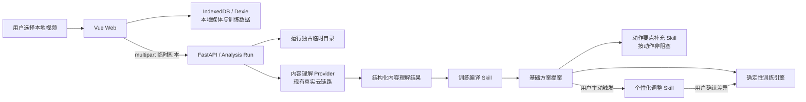

# TrainPal 独立 Web 技术架构合同

> 状态：已冻结用于 Vue design v1；实现状态以第 12 节为准
>
> 更新日期：2026-07-23
>
> 适用范围：本地视频导入、内容理解、训练编译、可选个性化、动作要点、训练执行与结果回顾

## 1. 目标与不可变边界

TrainPal 将用户已经保存且有权使用的健身视频转成一场可编辑、可立即执行的训练。当前交付是独立 Web，不依赖平台内入口或未开放接口。

- 本地视频导入是主入口，受控视频源是明确标注的快速体验兜底。客户端不能提交任意服务器路径、远程 URL、平台 Cookie 或登录态。
- 原视频只在当前设备浏览器长期保存。服务端上传副本和分析材料只属于单次运行，并在所有终态清理。
- 分析只由用户显式创建。页面切换、刷新或 SSE 断线不取消；显式取消、更换来源、运行安全边界或进程丢失才结束运行。
- 当前竞赛能力为完整覆盖不超过 5 分钟的源文件，`GET /api/v1/capabilities` 返回 300 秒和 256 MiB 的真实边界。7／19 分钟原片必须先在应用外裁成不超过 5 分钟，不能用首次请求的内部区间冒充完整分析。
- 过程反馈来自真实处理位置和暂时发现的动作线索数。部分结果必须明确覆盖缺口并允许逐段重试，不能把系统错误伪装成没有动作。
- 当前 production Provider 保持火山 ASR、Ark Seed 和确定性融合，但视觉改为连续 MP4 的 60 秒分块、10 秒重叠、单并发顺序处理，不以稀疏截图冒充完整窗口。内部视觉块以有界码率转码后直接作为 Ark Responses API 的 Base64 视频输入，不创建方舟 Files API 托管文件；超过 45,000,000 bytes 的块明确成为 `media_error` 覆盖缺口。语音与视觉共享 170 秒证据截止时间，并为 180 秒外层上限预留 10 秒终态和清理余量。目标 CloudBase 上的真实短视频、五分钟样本、三并发和清理仍须通过 Canary 才能宣称交付。生产环境不使用测试 Provider 或预置候选回退。
- 用户只看到一个 TrainPal Agent。内容理解 Provider、三个领域 Skill 和确定性训练引擎是内部能力层，不形成额外用户角色。
- 训练计时、休息、进度、记录和卡路里由确定性代码负责，不进入开放式 Agent 循环。

## 2. 总体拓扑



当前内容理解 Provider 继续使用已经接入的真实 Ark、豆包流式语音识别 2.0 与确定性媒体处理／融合路径。原生音视频 benchmark 尚未选出通过全部硬门槛的新方案，因此不切换 Provider。竞赛基线已实现一次 ASR 与 60／10 秒顺序视觉分块，并能保留可靠分块及定位 `partial` 缺口；目标 CloudBase 的真实短视频、五分钟样本与逐段重试仍须通过 Canary。

## 3. 页面与移动端边界

页面按用户旅程拆分，路由合同为：

| 路由 | 主要任务 | Shell |
| --- | --- | --- |
| `/` | 解释价值、选择本地视频、找回少量最近项目 | 顶层，明亮手账主题 |
| `/analysis` | 查看真实阶段、覆盖进度、动作数、取消／重试 | 沉浸式 |
| `/plan` | 查看基础方案摘要、按需编辑、开始训练 | 沉浸式 |
| `/personalize` | GYMTI、教练风格、可选个人信息与调整提案 | 沉浸式步骤流 |
| `/train` | 当前方案、继续未完成训练、已保存方案 | 顶层，明亮手账主题 |
| `/training` | 执行当前训练场次 | 沉浸式，深色训练主题 |
| `/result/:recordId` | 回顾结果、分享或下载 | 沉浸式 |
| `/mine` | 记录、GYMTI、个人信息、教练风格、成长与设置 | 顶层，明亮手账主题 |

顶层导航只有“首页 / 训练 / 我的”。存在未完成训练时，所有非训练页显示同一个轻量“继续训练”入口；分析任务进行中时可以显示同类全局任务入口。移动端先保证单列、至少 44 CSS px 触控目标、安全区、软键盘和底部固定主操作；宽屏只增加辅助预览，不渲染固定手机外壳。

视频按源文件原始比例展示。训练页使用 `contain`，来源片段默认播放一次后暂停；只有内容理解结果明确包含可靠来源节奏时，训练编译才把节奏块展开为扁平执行步骤。

## 4. 数据所有权与生命周期

| 数据 | 权威位置 | 生命周期 |
| --- | --- | --- |
| 本地来源媒体 Blob 与元数据 | 浏览器 IndexedDB | 同设备持久化；用户可清除或重新选择恢复 |
| 受控来源清单与分析媒体 | 服务端受控配置 | 随部署版本更新 |
| 上传副本、音频、视觉块、转录、提示与模型原始响应 | 单次运行临时目录或内存 | 成功、部分完成、失败、取消均清理；当前 Ark 路径不创建托管文件 |
| Analysis Run 状态、事件和容量占用 | 单 FastAPI 进程 | 活跃期及短时终态 TTL；重启即丢失 |
| 草稿、方案、Skill 成功结果、场次、记录、档案、偏好 | 浏览器 IndexedDB | 同设备持久化；用户可清除 |
| 完成海报 | 浏览器即时生成 | 分享或下载，不保存为服务端资产 |

服务端日志只能记录运行／来源 ID、阶段、耗时、版本、Provider 请求 ID 和脱敏错误码。文件名、媒体内容、转录、提示、模型响应、用户档案和秘密不得进入日志。

## 5. 浏览器本地媒体

本地媒体逻辑记录保持稳定来源 ID：

```ts
interface LocalSourceMedia {
  sourceId: `local:${string}`
  blob: Blob
  fileName: string
  mimeType: 'video/mp4' | 'video/quicktime' | 'video/webm'
  sizeBytes: number
  lastModified: number
  durationSeconds: number
  importedAt: string
  updatedAt: string
}
```

- `sourceId` 由浏览器生成规范小写 UUID，不含路径、文件名或内容哈希。
- 导入前先读取能力接口，再校验 MIME、大小和媒体时长；客户端校验不能替代服务端校验。
- 播放使用 Blob 对象 URL，组件释放或换源时撤销 URL，但不自动删除 IndexedDB 记录。
- 持久化失败时可在当前标签页使用内存 Blob，但必须标明“仅本次打开可用”。
- 本地 Blob 丢失不删除方案、场次或记录。用户重选文件时先核对基础指纹和时长，再绑定到同一个 `sourceId`。
- 清除本机数据应在一个事务内清理本地媒体与训练表，并释放对象 URL。

现有数据库的内部名称和旧字段可为兼容保留，但它们不是面向用户的产品命名；任何迁移不得破坏既有动作 ID、方案或记录。

## 6. 公共分析 API

### 6.1 能力

`GET /api/v1/capabilities`

```ts
interface CapabilitiesView {
  local_upload_enabled: boolean
  local_analysis_max_seconds: number
  local_upload_max_bytes: number
}
```

接口只返回部署已经验证的能力，不返回未来目标、Provider 名称、内部模型 ID 或密钥。前端不得用编译时常量扩大这些值。能力读取失败时，本地上传失败关闭，受控快速体验仍可用。
`local_analysis_max_seconds` 必须在 `(0, 300]` 内，且比赛生产配置固定为 `300`；`local_upload_max_bytes` 必须为正整数。功能关闭时仍返回配置边界，由 `local_upload_enabled` 单独控制创建能力。

### 6.2 创建本地分析

`POST /api/v1/analysis-runs/local` 使用 `multipart/form-data`：

- `media`：必填，允许的 MIME 由能力合同限定；
- `local_source_id`：必填，格式为 `local:<UUID>`；
- `range_start_seconds`、`range_end_seconds`：成对可选，仅用于显式覆盖缺口重试。

无区间时处理完整来源；有区间时必须位于视频边界内。创建成功返回 `202` 与运行快照，动作及证据时间始终使用原视频绝对秒数。

### 6.3 运行接口

- `POST /api/v1/analysis-runs`：以受控 `source_id` 创建兜底分析；
- `GET /api/v1/analysis-runs/{run_id}`：读取权威快照；
- `GET /api/v1/analysis-runs/{run_id}/events`：接收 SSE 阶段、进度与终态；
- `DELETE /api/v1/analysis-runs/{run_id}`：仅用于用户显式取消；
- `GET /api/v1/sources` 与媒体接口：继续服务受控快速体验。

访问分级、同源校验、频率和并发门禁覆盖两种创建入口。容量耗尽返回 `429 + Retry-After`，不建立后台队列。

## 7. 内容理解合同

内容理解 Provider 的终态覆盖只允许：

```ts
type CoverageStatus = 'complete' | 'partial' | 'insufficient'

interface CoverageGap {
  start_seconds: number
  end_seconds: number
  reason: 'provider_error' | 'timeout' | 'media_error' | 'unknown'
  retryable: boolean
}

interface AnalysisRunView {
  // 现有字段保持不变
  source_duration_seconds: number
  processed_seconds: number
  discovered_candidate_count: number
  coverage_status: 'complete' | 'partial' | 'insufficient' | null
  coverage_gaps: CoverageGap[]
}
```

- 公开和持久化的 `AnalysisCandidate` 不包含 `segment_role`。Provider 内部角色只能影响 `needs_confirmation`，不能成为 wire contract 或要求用户判断“教学／跟练”的产品步骤；来源片段长度不得自动映射到 `parameters.duration_seconds`。
- `source_duration_seconds` 是有限正数且表示原视频完整时长；`processed_seconds` 是本次请求范围已经实际处理的有限非负时长，必须在 `[0, requested range length]` 内单调前进。
- `discovered_candidate_count` 是非负整数；非终态表示已完成证据分支返回的只读动作线索数，允许在融合时收敛，可靠终态才表示融合候选数。
- 排队、运行、失败和取消时 `coverage_status=null`。可靠终态的请求范围完整时为 `complete`；有可靠候选但仍有系统未知区间时为 `partial`；没有足够可靠候选且存在未检查区间时为 `insufficient`。后二者都提供非重叠、按时间排序的 `coverage_gaps`。
- 当前产品中的部分结果缺口必须可单独重试；`reason` 是独立、版本化的公开安全枚举，非白名单值不能进入 GET／SSE。用户界面只展示自然中文，不显示 Provider 正文。
- 区间重试是新的 Analysis Run。其 `coverage_status=complete` 表示该请求区间完整；客户端把结果合并回来源级覆盖状态，而不是修改旧运行记录。
- `complete` 只表示已检查完整范围，不承诺每个动作判断绝对正确。
- `partial` 必须列出已覆盖与未覆盖范围；可靠动作仍可进入训练编译。
- `insufficient` 表示没有足够可靠证据形成基础方案，只提供重试和手工创建动作。
- 静音、无字幕或 ASR 空结果不能单独成为 `insufficient`，视觉分支仍必须执行。
- 正常覆盖但没有动作证据的区间不是覆盖缺口；系统故障也不能伪装成“没有动作”。

Provider 输出结构化内容理解结果，至少包含来源、时长、覆盖状态、按来源顺序排列的动作、来源片段、视频明确参数、只读来源证据快照、不确定标记和可选来源节奏。它不包含原始媒体、完整转录、模型响应、GYMTI、个人信息或训练历史。

服务端流程保持“确定性媒体处理 + 动作分析 Agent 协调 Skills”。全范围只抽取一次音频并执行一次 ASR；视觉块分别受 20 秒限制，语音与视觉共享运行内证据截止时间，整次运行受 180 秒限制。视觉块使用连续 MP4 的 Base64 内联请求，并显式路由到视觉模型；不允许在取消竞态下改用会遗留未知远端 ID 的临时上传。既有或在途 benchmark 未通过全部硬门槛前不切换 Provider，也不沿用旧单样本延迟作为五分钟承诺；真实缺口定位与重试仍须完成目标部署验收。

公开合同不再包含片段用途分类。没有可靠来源节奏时，片段只作参考；有可靠节奏时，Provider 输出时间线级动作、休息和切换块，由训练编译展开。

SSE 包络继续使用 `{sequence,type,run_id,timestamp,data}`。断线后客户端先 GET 快照再重连，只应用当前来源和 `run_id` 的事件，并对重放 `sequence` 保持幂等。服务器不能把 SSE 断线当作取消信号。

- 客户端以 `local_source_id` 作为来源边界，将成功区间内的新候选按绝对开始时间合并，并只移除实际覆盖的缺口。
- 用户已经校正的候选优先；新候选与其时间重叠时要求确认，不能静默覆盖。重试失败保留旧候选和缺口。
- 正常分析完成但没有动作证据的区间属于已覆盖区域，不生成 `coverage_gaps`；整段无证据才返回空结果。
- Agent 只把带时间的语音或其他可定位证据写入训练参数。没有证据的组数、次数、时长、休息和重量都保持为空；内部角色冲突或单一证据分支只表现为 `needs_confirmation=true`。
- 重复和循环动作按来源绝对顺序形成展开式执行时间线。传给方案的每次动作出现都是独立、扁平的 `DraftItem`；不新增嵌套循环状态机。

当前纵切片不要求独立时间线编辑器或新的嵌套公开 Schema；只要 Provider 返回重复候选，Web 就按绝对时间展开。证据不足或冲突且会影响参数时，候选必须保持需确认状态。

## 8. TrainPal Agent 与三个 Skill

TrainPal 使用确定性外层流程：

1. 内容理解 Provider 形成结构化结果；
2. 训练编译 Skill 必须先形成可立即使用的基础方案；
3. 动作要点补充 Skill 对已确认动作分别非阻塞运行；
4. 个性化调整 Skill 只在用户主动选择时运行，不等待动作要点；
5. 用户确认基础提案或个性化差异后，确定性训练引擎消费当前方案。

三个 Skill 不互相调用、不读取原始媒体、不写草稿、不读取训练状态机，也不进入无限规划或反思循环。共享任务信封只包含：

```ts
interface SkillTaskEnvelope {
  task_id: string
  task_type: 'training_compilation' | 'personalization' | 'action_tips'
  contract_version: string
  skill_version: string
  input_version: number
  input_fingerprint: string
}
```

相同幂等键复用同一次运行或成功结果；成功结果刷新后保持稳定。只有用户明确重试或重新生成才创建新任务。输入已经变化、任务被替换或页面已接受更新版本时，迟到结果直接丢弃。

## 9. 方案、来源节奏与字段来源

训练编译 Skill 按来源顺序生成整份基础方案提案，而不是把独立候选收件箱交给用户。可靠动作可直接进入提案；待确认动作原位保留但默认排除，不阻塞其他动作。

```ts
type FieldSource = 'video' | 'rule' | 'personalized' | 'user'

interface SourcedValue<T> {
  value: T
  source: FieldSource
}
```

- 视频明确值标记为 `video`；缺失参数由版本化确定性规则补成 `rule`。
- 用户主动确认的个性化差异标记为 `personalized`。
- 用户编辑始终标记为 `user`，且优先级高于全部建议和规则。
- 重量只能由用户填写，不能来自视频、规则或个性化。
- 用户可以自由修改名称、顺序、模式、组数、次数或时长、休息、重量和参考范围；系统只执行可执行性校验。

可靠来源节奏内的重复动作按真实顺序展开，例如 `A1 → B1 → A2 → B2`。每次出现都是独立扁平步骤；不建立嵌套循环状态。没有可靠节奏时，标准动作、器械和变式相同的重复演示合并为一个方案动作，并保留证据最完整的连续参考片段。

## 10. 个性化与动作要点

个性化入口文案为“让 TrainPal 调整这次训练”，不阻塞用户直接训练。个性化上下文包括用户明确维护的 GYMTI、训练经验、教练风格、可选训练档案，以及关联到具体动作／方案／场次的结构化轻反馈。

- 年龄、性别、身高和体重是可选档案，主要用于卡路里约值，只能作为个性策略的弱参考；不得据此推断人格、健康状态或直接决定训练强度。
- 个性化只能在确定性允许范围内提出整套字段差异，不能替换／重排动作、增加重量或覆盖用户值。
- 基础方案变化使旧提案不可应用；GYMTI、教练风格或个人信息变化只提示“基于旧了解”，用户仍可应用或明确重新调整。
- 生成失败时基础方案保持可用，不展示部分个性化，也不把规则值伪装成个性化结果。

动作要点 Skill 只处理已确认动作，每个动作最多三条。依据只能是 `video | web | model`：网页依据必须保留有效引用；模型世界知识明确显示为“TrainPal 通用建议”。冲突内容按 `video > web > model` 选择，但该顺序只表示保留来源意图，不代表专业等级。训练中不联网、不实时生成、不做姿态或伤病判断。

## 11. 安全、失败与部署边界

- API Key 只在后端环境中使用，不进入 multipart、SSE、错误响应、SPA 或 IndexedDB。
- 临时目录按运行隔离，在完整、部分、证据不足、空、失败、取消和超时后统一清理。
- 本地媒体丢失不删除结构化训练数据；训练仍可继续，播放区要求重新选择原视频。
- 当前单 FastAPI 进程仍是运行、事件、取消和容量协调边界。增加 worker 或实例前必须实现共享运行注册表或完整会话粘滞，并另立 ADR。
- 竞赛公网入口当前采用 CloudBase Run 的单服务同源拓扑；Caddy／自定义域名只保留为历史或运维备选。详细门禁见[竞赛发布 Runbook](../release/competition-runbook.md)。

## 12. 当前实现状态与验收差距

截至 2026-07-23：

- 本地导入、受控来源、Analysis Run、SSE、浏览器训练数据和真实云 Provider 已有工程基线；五分钟分块后端提交与 TrainPal Vue design v1 提交正在同一发布分支集成。
- 生产配置已经声明 300 秒，并以 OA、0% 流量提交 CloudBase 私有灰度版本 A；在私有 `/ready`、真实 Provider、恢复与清理验收完成前，不得把配置存在表述为能力已上线。
- 新的公开内容理解结果、三个 TrainPal Skill、四态字段来源和个性化提案时效是冻结后的生产合同，仍需按切片接入并生成／核对 OpenAPI 与前端类型。
- 签名 FFmpeg 镜像已完成本地构建、收据与唯一二进制审计；CloudBase 云端构建、私有门禁、公网 Canary、真实并发和回滚 smoke 尚未全部通过，不得表述为已上线。

发布门禁还必须覆盖：能力预检，非法 ID／超限／损坏媒体／区间边界，完整／部分／证据不足／系统失败区分，SSE 恢复与迟到结果拒绝，覆盖缺口绝对时间合并，IndexedDB 迁移与 Blob 恢复，以及所有终态材料清理与无秘密扫描。

发布前至少验证：能力预检、完整／部分／证据不足／系统失败区分、SSE 恢复、迟到结果拒绝、来源节奏展开、四态来源优先级、三个 Skill 幂等与提案时效、所有终态清理、移动端主旅程和真实 Provider smoke。

## 13. 关联决策

- [ADR-0013：本地视频优先与可恢复分析](../adr/0013-local-video-import-and-recoverable-analysis.md)
- [ADR-0015：TrainPal 统一产品、Agent 与教练身份](../adr/0015-trainpal-unifies-product-agent-and-coach-identity.md)
- [ADR-0017：来源片段与可靠来源节奏](../adr/0017-source-clips-are-reference-unless-reliable-rhythm-exists.md)
- [ADR-0018：三个领域 Skill](../adr/0018-trainpal-orchestrates-base-compilation-and-optional-personalization.md)
- [ADR-0019：个性化提案时效](../adr/0019-plan-changes-invalidate-personalization-proposals.md)
- [ADR-0023：Skill 任务幂等](../adr/0023-skill-tasks-are-idempotent-and-version-bound.md)
- [ADR-0025：覆盖状态](../adr/0025-provider-declares-complete-partial-or-insufficient-coverage.md)
- [ADR-0026：旅程页面与移动端](../adr/0026-journey-pages-replace-the-douyin-style-single-stage.md)
- [ADR-0029：CloudBase Run 竞赛入口](../adr/0029-cloudbase-run-is-the-unfiled-competition-demo-entry.md)
