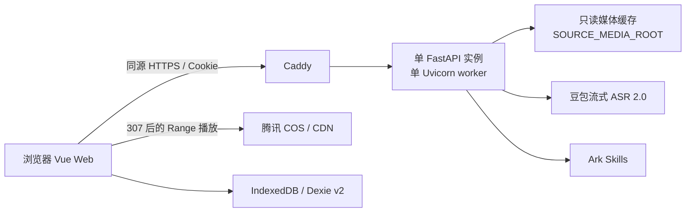

# 竞赛 Web MVP 技术架构合同

> 状态：已冻结，可供 Issue #3 的后续纵切片实现
>
> 更新日期：2026-07-21
>
> 适用范围：三天竞赛 Web 版本；不代表公开规模化架构

## 1. 目标与不变量

竞赛版在一个公网 HTTPS 站点中完成“动作识别—方案编排—训练—记录—海报”闭环。实现必须保持以下不变量：

- 浏览器只提交受控 `source_id`，不能让服务端读取任意路径、代理任意 URL 或抓取信息流。
- 方案、训练档案、未完成训练和训练记录只保存在当前设备的 IndexedDB；后端不建立用户数据库。
- 动作分析请求仍是内存态、可取消的临时任务。SSE 断开、显式取消、切换视频或 180 秒超时都会终止请求并释放容量。
- 生产环境只运行真实 Ark 与豆包流式语音识别模型 2.0。快速体验方案是明确标注的静态产品样例，不是假的 Agent 结果或运行时回退。
- 原始媒体、音频、帧、转录和模型原始响应不进入训练数据、日志、仓库或镜像。

## 2. 运行拓扑与数据所有权



| 数据 | 唯一权威位置 | 生命周期 |
| --- | --- | --- |
| 来源清单、SHA-256、出处链接 | 服务端受控清单 | 随部署版本更新 |
| 浏览器播放媒体 | COS/CDN | 团队运维控制，不进 Git |
| 后端分析媒体 | 服务器只读缓存 | 随部署同步，不由客户端写入 |
| 分析请求、事件和容量占用 | 单 FastAPI 进程内存 | 终态十分钟后过期；重启即丢失 |
| 分析临时材料 | 每次请求独立临时目录、Ark 临时文件 | 成功、失败、取消和超时均清理 |
| 草稿、方案、场次、记录、档案、偏好 | 浏览器 IndexedDB | 同设备持久化，用户可清除 |
| 完成海报 | 浏览器由训练记录即时生成 | 分享或下载，不作为数据库 Blob 保存 |

编译后的 Vue SPA 与 FastAPI 放入同一个 `app` 镜像，由 FastAPI 提供静态文件和 history fallback；Caddy 只负责 TLS、压缩和反向代理。生产环境不开放 FastAPI 容器端口到公网。

## 3. 受控来源与 COS/CDN

`SOURCE_MANIFEST_PATH` 指向部署时版本化的 JSON 清单，格式固定为：

```json
{
  "version": 1,
  "sources": [
    {
      "id": "arm-workout-01",
      "title": "手臂训练 01",
      "media_path": "competition/arm-workout-01.mp4",
      "duration_seconds": 96.4,
      "sha256": "64-character-lowercase-hex",
      "origin_url": "https://www.douyin.com/video/..."
    }
  ]
}
```

- `id` 必须唯一且稳定；`media_path` 必须是无 `..` 的相对 POSIX 路径。
- 分析文件只允许解析为 `SOURCE_MEDIA_ROOT/media_path` 下的普通文件，启动时校验 SHA-256，并验证实际时长与清单相差不超过一秒。
- 播放地址只允许由 `PUBLIC_MEDIA_BASE_URL` 与受控 `media_path` 拼接。客户端输入永远不能成为重定向目标。
- `origin_url` 可为 `null`，只用于“查看原视频”找回出处；后端不会抓取或分析该 URL。
- 任一清单、路径、哈希或时长校验失败时，该实例不得进入 ready；不能悄悄略过异常来源。

`GET /api/v1/sources` 保持现有字段，并增加可选 `origin_url`：

```ts
interface SourceSummary {
  id: string
  title: string
  media_url: string
  duration_seconds: number
  origin_url: string | null
}
```

`media_url` 仍为同源 `/api/v1/sources/{source_id}/media`。该接口校验来源后返回 `307 Temporary Redirect` 到 COS/CDN，浏览器把 Range 请求继续交给对象存储；未知来源返回 404。训练中的演示片段只改变播放时间和循环边界，不生成裁剪后的视频文件。

## 4. 访问分级与分析容量

### 4.1 会话接口

新增以下同源接口：

| 方法 | 路径 | 行为 |
| --- | --- | --- |
| `GET` | `/api/v1/access/session` | 创建或读取匿名会话，返回当前层级和是否可发起分析 |
| `POST` | `/api/v1/access/session` | 接收 `{access_code}`，校验评委体验码并升级当前会话 |
| `GET` | `/api/v1/ready` | 返回无敏感信息的生产就绪结果 |

访问响应为：

```ts
interface AccessSessionView {
  tier: 'public' | 'judge'
  can_analyze: boolean
  retry_after_seconds: number | null
}
```

服务端签发 `hachimi_access` Cookie，内容只有随机会话 ID、层级和过期时间并由 `ACCESS_COOKIE_SECRET` 签名；Cookie 使用 `Secure`、`HttpOnly`、`SameSite=Lax`，有效期十二小时。`JUDGE_ACCESS_CODE` 只在后端以常量时间比较，失败统一返回 401，不暴露是否已配置或具体原因。所有改变状态的请求检查同源 `Origin`；Caddy 是唯一可信代理，应用不接受公网直连伪造的转发地址。

### 4.2 准入规则

- 每个匿名会话同时最多一个未终态分析请求。
- 评委池默认 `JUDGE_ANALYSIS_CONCURRENCY=3`，公共池默认 `PUBLIC_ANALYSIS_CONCURRENCY=1`，两个池互不挤占；低配服务器可把公共池设为 0。
- 公共会话每十分钟最多创建一次分析，评委会话每小时最多十次；会话 ID 为主键，并使用可信代理提供的客户端 IP 做第二层滥用保护。
- 创建成功后立即占用对应槽位；完成、失败、取消、SSE 断开和超时都必须在 `finally` 中释放。服务重启清空内存限流和占用状态。
- 没有槽位或超过频率时，`POST /api/v1/analysis-runs` 返回 429、`Retry-After` 和自然中文提示。系统不排队、不在后台等待，也不返回预置候选。
- 已创建请求的层级在创建时固定；中途升级 Cookie 不迁移或复制请求。

普通访客始终可以使用前端内置的快速体验方案，完成训练、记录和分享。公共实时 AI 关闭或繁忙时，界面清楚区分“快速体验”和“真实分析暂时繁忙”。

## 5. Analysis Run 与 SSE

现有分析接口和候选 Schema 保持兼容：

- `POST /api/v1/analysis-runs`
- `GET /api/v1/analysis-runs/{run_id}/events`
- `GET /api/v1/analysis-runs/{run_id}`
- `DELETE /api/v1/analysis-runs/{run_id}`

创建请求在原有 `source_id`、时间边界校验之前先完成会话限流和容量准入。SSE 继续使用 `{sequence,type,run_id,timestamp,data}` 包络，15 秒发送一次心跳。Caddy 必须关闭响应缓冲和缓存，并把上游读取超时设为大于 180 秒；浏览器 `EventSource` 使用同源 Cookie。断线不恢复原请求，服务端取消运行，用户重试会得到新 `run_id`。

单分支成功、空结果、系统失败、临时材料清理和迟到结果丢弃继续遵循 ADR-0006、0008、0009，不因部署层级改变。公开响应和日志不得加入转录、模型原始响应、提示词、置信度或密钥。

## 6. 就绪、失败与安全行为

`GET /api/v1/health` 只证明进程存活，不调用外部提供方。`GET /api/v1/ready` 在以下条件全部满足时返回 200：

- `APP_ENV=production`、`ANALYSIS_PROVIDER=cloud`，两项云端密钥和三个 Skill 均已配置；
- 来源清单可解析，所有本地媒体的路径、哈希和时长校验通过；
- 分析临时根目录可创建、写入和删除探针文件；
- 访问 Cookie 密钥、评委码以及并发配置有效，未启用测试 Provider。

失败返回 503 和安全检查码，例如 `source_manifest_invalid`、`media_cache_invalid`、`provider_configuration_invalid`、`temp_storage_unavailable`；响应不能包含本机路径、密钥片段或提供方正文。就绪检查不为每次探针调用真实模型；真实 Provider 可用性由发布 smoke 验证。

| 故障 | 外部行为 |
| --- | --- |
| 来源不存在 | 404，不尝试下载或猜测来源 |
| 容量或频率受限 | 429 + `Retry-After`，保留访客快速体验入口 |
| 一个分析分支失败但另一个有证据 | 部分成功，并携带非技术化警告 |
| 两个提供方正常但没有证据 | 完成且候选为空 |
| 系统错误导致无证据 | 明确失败，不伪装为空结果 |
| 应用重启 | 进行中的分析失败并释放；浏览器本地训练数据不受影响 |
| COS 播放失败 | 显示视频不可用；已有自建动作和方案仍可训练 |

生产环境使用同源请求，不依赖宽泛 CORS；本地 Vite 开发才允许明确列出的 localhost Origin。密钥只通过 `/opt/hachimi/shared/.env.production` 注入后端，镜像、SPA、来源清单、错误响应和日志均不得包含密钥。

## 7. 单实例部署合同

部署入口固定为 `deploy/compose.yml` 和 `deploy/Caddyfile`：

- `app`：一个容器、一个 FastAPI 实例、一个 Uvicorn worker，包含编译后的 SPA。
- `caddy`：唯一公网入口，负责 HTTPS 和 SSE 透传。
- 环境文件：`/opt/hachimi/shared/.env.production`。
- 分析媒体：`/var/lib/hachimi/media`，只读挂载为 `SOURCE_MEDIA_ROOT`。
- 媒体同步：发布前用同一 GHCR `app` 镜像一次性运行 `python -m hakimi_analysis.sync_media`，清单只读、媒体根可写；同步和哈希校验成功后，常驻 `app` 才以只读方式挂载媒体根。
- 镜像以提交 SHA 标记；回滚只切换到上一个验证过的 SHA，不执行服务端数据迁移。

单 worker 是正确性边界，不是临时调优：分析请求、SSE 事件、取消句柄、准入池和限流窗口都在进程内。竞赛版禁止增加 worker、容器副本或负载均衡随机分发。扩为多实例前，必须先引入共享运行注册表、跨实例取消和容量协调，或证明完整的会话粘滞方案，并新增 ADR。

## 8. 扩展边界

- 抖音适配器以后只负责生成同一 `source_id`/`SourceSummary` 契约，不改变训练动作、演示片段和方案模型。
- 账号和跨设备同步以后通过替换训练 Repository 接入；训练状态机不直接依赖网络或用户身份。
- 用户上传视频、用户上传 Pet、后台分析队列和完整生产扩缩容不属于竞赛版，不能以预留代码路径提前实现。
- 50 人并发验收针对静态页面、快速体验和本地训练；确定性 Test Provider 只能在 `APP_ENV=test` 且仅监听 loopback 的隔离候选环境中用于该负载测试。生产环境只验证受控的三路真实评委并发，超出容量必须稳定返回 429，而不是追求 50 路模型调用。

## 9. 运维配置

竞赛版新增且只由后端读取的变量如下：

| 变量 | 含义 |
| --- | --- |
| `SOURCE_MANIFEST_PATH` | 受控来源清单绝对路径 |
| `SOURCE_MEDIA_ROOT` | 校验后的本地分析媒体根目录 |
| `PUBLIC_MEDIA_BASE_URL` | COS/CDN 的 HTTPS 公共播放前缀 |
| `JUDGE_ACCESS_CODE` | 评委体验码 |
| `ACCESS_COOKIE_SECRET` | 匿名访问 Cookie 的签名密钥 |
| `JUDGE_ANALYSIS_CONCURRENCY` | 评委保留分析槽位，默认 3 |
| `PUBLIC_ANALYSIS_CONCURRENCY` | 公共分析槽位，默认 1，可设为 0 |

现有 Ark、ASR、超时和 TTL 变量继续有效。部署流程通过同镜像的一次性同步命令准备媒体，并在切换流量前检查 `/api/v1/ready`；宿主机不要求安装 Python 或 uv。完整发布与回滚步骤由竞赛发布运行手册定义。

## 10. 关联决策

- [ADR-0006：Agent 不长期保存原始媒体](../adr/0006-agent-does-not-retain-raw-media.md)
- [ADR-0007：Web-first 使用受控视频源](../adr/0007-web-first-controlled-video-sources.md)
- [ADR-0008：显式、临时且可取消的分析管线](../adr/0008-explicit-transient-analysis-pipeline.md)
- [ADR-0011：竞赛部署采用同源单实例](../adr/0011-single-instance-competition-deployment.md)
