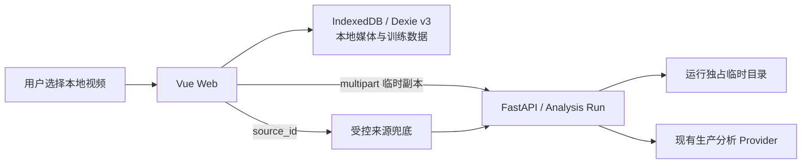

# 本地视频训练原型 Web 技术架构合同

> 状态：下一轮原型已冻结；实现通过验收前不得表述为全部完成
>
> 更新日期：2026-07-23
>
> 适用范围：独立 Web 原型；竞赛受控来源部署细节继续见历史 Runbook

## 1. 目标与不变量

原型在一个 Web 应用中完成“本地视频导入—动作分析—方案编排—训练—记录”闭环。实现必须保持以下不变量：

- 本地视频导入是主入口，受控视频源是明确标注的快速体验兜底。客户端不能提交任意服务器路径、远程 URL、平台 Cookie 或登录态。
- 原视频只在当前设备浏览器长期保存。服务端上传副本和分析材料只属于单次运行，并在所有终态清理。
- 分析只由用户显式创建。页面切换、刷新或 SSE 断线不取消；显式取消、更换来源、运行安全边界或进程丢失才结束运行。
- 当前竞赛能力为完整覆盖不超过 5 分钟的源文件，`GET /api/v1/capabilities` 返回 300 秒和 256 MiB 的真实边界。7／19 分钟原片必须先在应用外裁成不超过 5 分钟，不能用首次请求的内部区间冒充完整分析。
- 过程反馈来自真实处理位置和暂时发现的动作线索数。部分结果必须明确覆盖缺口并允许逐段重试，不能把系统错误伪装成没有动作。
- 当前 production Provider 保持火山 ASR、Ark Seed 和确定性融合，但视觉改为连续 MP4 的 60 秒分块、10 秒重叠、单并发顺序处理，不以稀疏截图冒充完整窗口。内部视觉块以有界码率转码后直接作为 Ark Responses API 的 Base64 视频输入，不创建方舟 Files API 托管文件；超过 45,000,000 bytes 的块明确成为 `media_error` 覆盖缺口。语音与视觉共享 170 秒证据截止时间，并为 180 秒外层上限预留 10 秒终态和清理余量。目标 CloudBase 上的真实短视频、五分钟样本、三并发和清理仍须通过 Canary 才能宣称交付。生产环境不使用测试 Provider 或预置候选回退。

## 2. 运行拓扑与数据所有权



| 数据 | 权威位置 | 生命周期 |
| --- | --- | --- |
| 本地来源媒体 Blob 与元数据 | 浏览器 IndexedDB | 同设备持久化；用户可清除或重新选择恢复 |
| 受控来源清单与分析媒体 | 服务端受控配置 | 随部署版本更新 |
| 上传副本、音频、视觉块、转录、提示与模型原始响应 | 单次运行临时目录或内存 | 成功、部分完成、失败、取消均清理；当前 Ark 路径不创建托管文件 |
| Analysis Run 状态、事件和容量占用 | 单 FastAPI 进程 | 活跃期及短时终态 TTL；重启即丢失 |
| 草稿、方案、场次、记录、档案、偏好 | 浏览器 IndexedDB | 同设备持久化；用户可清除 |
| 完成海报 | 浏览器即时生成 | 分享或下载，不保存为数据库 Blob |

客户端恢复 Analysis Run 只依赖同一匿名会话中的 `run_id` 和服务端快照，不依赖服务端保留来源媒体。服务重启后无法恢复是当前原型的明确边界；未来多实例或跨重启恢复需要共享运行注册表和新 ADR。

## 3. 浏览器本地媒体仓储

Dexie v3 在现有训练表之外增加本地媒体表。逻辑记录如下：

```ts
interface LocalSourceMedia {
  sourceId: `local:${string}`
  blob: Blob
  fileName: string
  mimeType: 'video/mp4' | 'video/quicktime' | 'video/webm'
  sizeBytes: number
  lastModified: number
  durationSeconds: number
  importedAt: string
  updatedAt: string
}
```

- `sourceId` 必须是规范小写 `local:<UUID>`，由浏览器生成；`DraftSourceRef.sourceId` 引用同一个值。它不包含路径、文件名或内容哈希。
- 导入顺序是先读取 `GET /api/v1/capabilities`，再探测 MIME、大小和媒体时长，最后以单条 Dexie 写入保存 Blob 与元数据。客户端校验不替代服务端校验。
- 播放使用从 Blob 创建的对象 URL；组件释放或切换来源时撤销旧 URL，但不删除 IndexedDB 记录。
- 写入失败时允许当前标签页使用内存 Blob，并明确标记“仅本次打开可用”。刷新恢复、稍后训练和复练不能依赖该降级路径。
- 本地记录缺失时，视频动作及结构化训练数据继续可读；播放区要求用户重新选择。重选先比对文件名、MIME、大小、`lastModified` 和时长，再把新 Blob 绑定到原 `sourceId`，不能自动创建不同来源替代。
- “清除本机训练数据”在一个本地事务中清理本地媒体及全部训练表；对象 URL 也必须释放。

旧 Dexie 数据没有来源种类时按 `controlled` 解释，不重写已有动作 ID、字段来源或训练记录。

## 4. 公共 API

### 4.1 能力接口

`GET /api/v1/capabilities` 返回部署真实能力：

```ts
interface CapabilitiesView {
  local_upload_enabled: boolean
  local_analysis_max_seconds: number
  local_upload_max_bytes: number
}
```

接口不返回未来目标、Provider 名称、内部模型 ID 或密钥。前端不得用编译时常量扩大这些值。能力读取失败时，本地上传失败关闭，受控快速体验仍可用。
`local_analysis_max_seconds` 必须在 `(0, 300]` 内，且比赛生产配置固定为 `300`；`local_upload_max_bytes` 必须为正整数。功能关闭时仍返回配置边界，由 `local_upload_enabled` 单独控制创建能力。

### 4.2 本地分析创建

`POST /api/v1/analysis-runs/local` 使用 `multipart/form-data`：

- `media`：必填，MIME 仅允许 `video/mp4`、`video/quicktime`、`video/webm`；
- `local_source_id`：必填，规范小写 `local:<UUID>`；
- `range_start_seconds` 与 `range_end_seconds`：成对可选，用于覆盖缺口的绝对来源区间。

无区间时处理完整来源；有区间时要求 `0 <= start < end <= source duration`。区间分析仍由浏览器重新上传原文件，服务端不复用上一次副本。创建成功返回 `202` 与 `AnalysisRunView`；候选及证据时间始终是原视频绝对秒数。

公开错误为：可信代理客户端地址无效 `400`、现有访问／同源校验失败 `403`、本地上传关闭 `404`、超过字节上限 `413`、不支持 MIME `415`、ID／媒体／时长／区间无效 `422`、容量 `429`、就绪 `503`。代理请求体上限必须与 `local_upload_max_bytes` 一致或更大，但不能无界放开。

### 4.3 现有接口

- `POST /api/v1/analysis-runs`：以受控 `source_id` 创建兜底分析；
- `GET /api/v1/analysis-runs/{run_id}`：读取权威快照；
- `GET /api/v1/analysis-runs/{run_id}/events`：接收 SSE 阶段、进度与终态；
- `DELETE /api/v1/analysis-runs/{run_id}`：仅用于用户显式取消或确认更换来源；
- `GET /api/v1/sources` 与媒体 Range 接口：继续服务受控快速体验。

访问会话、频率和并发门禁继续覆盖两种创建入口。本地上传不能绕过现有 `403`、`429` 和生产就绪检查。

## 5. Analysis Run 与恢复

`AnalysisRunView` 在现有字段上增加：

```ts
type CoverageGapReason =
  | 'provider_error'
  | 'timeout'
  | 'media_error'
  | 'unknown'

interface CoverageGap {
  start_seconds: number
  end_seconds: number
  reason: CoverageGapReason
  retryable: boolean
}

interface AnalysisRunView {
  // 现有字段保持不变
  source_duration_seconds: number
  processed_seconds: number
  discovered_candidate_count: number
  coverage_status: 'complete' | 'partial' | 'insufficient' | null
  coverage_gaps: CoverageGap[]
}
```

- 公开和持久化的 `AnalysisCandidate` 不包含 `segment_role`。Provider 内部角色只能影响 `needs_confirmation`，不能成为 wire contract 或要求用户判断“教学／跟练”的产品步骤；来源片段长度不得自动映射到 `parameters.duration_seconds`。
- `source_duration_seconds` 是有限正数且表示原视频完整时长；`processed_seconds` 是本次请求范围已经实际处理的有限非负时长，必须在 `[0, requested range length]` 内单调前进。
- `discovered_candidate_count` 是非负整数；非终态表示已完成证据分支返回的只读动作线索数，允许在融合时收敛，可靠终态才表示融合候选数。
- 排队、运行、失败和取消时 `coverage_status=null`。可靠终态的请求范围完整时为 `complete`；有可靠候选但仍有系统未知区间时为 `partial`；没有足够可靠候选且存在未检查区间时为 `insufficient`。后二者都提供非重叠、按时间排序的 `coverage_gaps`。
- 当前产品中的部分结果缺口必须可单独重试；`reason` 是独立、版本化的公开安全枚举，非白名单值不能进入 GET／SSE。用户界面只展示自然中文，不显示 Provider 正文。
- 区间重试是新的 Analysis Run。其 `coverage_status=complete` 表示该请求区间完整；客户端把结果合并回来源级覆盖状态，而不是修改旧运行记录。

SSE 包络继续使用 `{sequence,type,run_id,timestamp,data}`，每个事件的 `data` 携带最新进度／覆盖快照。浏览器断线后先 GET 快照，再重连事件流；客户端只应用当前来源与 `run_id` 的事件，并对重放 `sequence` 保持幂等。服务器不能把连接关闭当作取消信号。运行代次仍隔离迟到事件，旧来源结果不得覆盖当前来源。

服务端流程保持“确定性媒体处理 + 动作分析 Agent 协调 Skills”。全范围只抽取一次音频并执行一次 ASR；视觉块分别受 20 秒限制，语音与视觉共享运行内证据截止时间，整次运行受 180 秒限制。视觉块使用连续 MP4 的 Base64 内联请求，并显式路由到视觉模型；不允许在取消竞态下改用会遗留未知远端 ID 的临时上传。既有或在途 benchmark 未通过全部硬门槛前不切换 Provider，也不沿用旧单样本延迟作为五分钟承诺；真实缺口定位与重试仍须完成目标部署验收。

## 6. 覆盖合并与来源时间线

- 客户端以 `local_source_id` 作为来源边界，将成功区间内的新候选按绝对开始时间合并，并只移除实际覆盖的缺口。
- 用户已经校正的候选优先；新候选与其时间重叠时要求确认，不能静默覆盖。重试失败保留旧候选和缺口。
- 正常分析完成但没有动作证据的区间属于已覆盖区域，不生成 `coverage_gaps`；整段无证据才返回空结果。
- Agent 只把带时间的语音或其他可定位证据写入训练参数。没有证据的组数、次数、时长、休息和重量都保持为空；内部角色冲突或单一证据分支只表现为 `needs_confirmation=true`。
- 重复和循环动作按来源绝对顺序形成展开式执行时间线。传给方案的每次动作出现都是独立、扁平的 `DraftItem`；不新增嵌套循环状态机。

当前纵切片不要求独立时间线编辑器或新的嵌套公开 Schema；只要 Provider 返回重复候选，Web 就按绝对时间展开。证据不足或冲突且会影响参数时，候选必须保持需确认状态。

## 7. 安全、隐私与失败行为

- 浏览器不会读取用户未主动选择的文件、目录、Cookie、浏览器配置或平台登录态。
- 上传文件名不得进入日志；日志只包含运行／来源 ID、阶段、处理时长、字节量级、版本、Provider 请求 ID 和脱敏错误码。
- API Key 只在后端环境中使用，不进入 multipart、SSE、错误响应、SPA 或本地媒体记录。
- 临时目录按运行隔离，并在完整、部分、空、失败、取消和超时终态统一清理。恢复依赖结构化运行状态，不得为恢复而延长原媒体副本生命周期。
- 服务端无法读取媒体、区间越界或来源不匹配时失败关闭；不得猜测时长、截断后继续或回填受控候选。
- 本地媒体丢失不删除方案或记录。播放区说明“需要重新选择原视频”，训练控制仍可继续。

## 8. 兼容与部署

- 现有受控 `source_id`、候选、草稿和训练记录继续可读；本地来源使用同一候选 `source_id` 字段承载 `local:<UUID>`。
- `DraftSourceRef` 增加可选 `kind: 'controlled' | 'local'` 和本地媒体指纹；缺少 `kind` 的旧记录按 `controlled` 读取。
- 当前单 FastAPI 实例仍是运行、事件、取消和容量协调边界。增加 worker 或副本前必须实现共享运行注册表或完整会话粘滞，并另立 ADR。
- 受控来源的 COS/CDN、清单、就绪、回滚与发布流程继续遵循[竞赛发布 Runbook](../release/competition-runbook.md)，但它不定义本地导入的产品上限或取消语义。

## 9. 验证门禁

- 能力接口与客户端预检一致覆盖上传关闭、MIME、字节数和实际媒体时长。
- multipart 正常、非法 ID、超限、损坏媒体、区间边界与访问／容量门禁均通过公共 API 测试。
- 页面切换、刷新和 SSE 断线恢复同一运行；显式取消和更换来源才释放运行，迟到结果被拒绝。
- 进度只来自实际处理位置；中间候选只读；完整、空、部分和失败语义分离。
- 覆盖缺口逐段重试，绝对时间合并正确，失败不丢失可靠结果或重试入口。
- IndexedDB v2→v3 无损升级，本地 Blob 可恢复播放；写入失败、清除数据和重新选择文件行为可验证。
- 每个终态都确认本地临时材料清理，并确认当前 Ark 路径没有创建 Provider 托管文件；日志、错误和前端构建不含文件名、内容、密钥或 Provider 正文。

## 10. 关联决策

- [本地视频训练原型规格](../specs/local-video-training-prototype.md)
- [ADR-0006：Agent 不长期保存服务端媒体](../adr/0006-agent-does-not-retain-raw-media.md)
- [ADR-0010：训练数据留在同设备](../adr/0010-local-training-data-and-single-active-session.md)
- [ADR-0013：本地视频优先与可恢复的覆盖分析](../adr/0013-local-video-import-and-recoverable-analysis.md)
